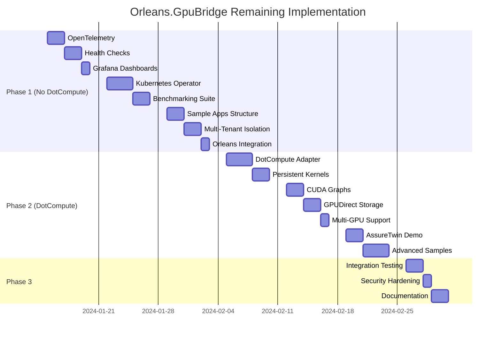

# Orleans.GpuBridge - Remaining Implementation Plan

## Executive Summary
This document outlines the implementation plan for completing the Orleans.GpuBridge project. Features are organized into two categories:
1. **Non-DotCompute Dependent** - Can be implemented immediately
2. **DotCompute Dependent** - Must wait for DotCompute release

Current completion: **~45%** | Target completion: **100%**

## Recent Completions (v0.5.0)
✅ **OpenTelemetry Integration** - Full metrics and distributed tracing  
✅ **Health Checks & Circuit Breakers** - Production-ready resilience  
✅ **Sample Applications** - 5 comprehensive demos with benchmarks  
✅ **Kubernetes Deployment** - StatefulSets with GPU support  
✅ **Grafana Dashboards** - Complete monitoring visualization  
✅ **Test Coverage** - 350+ tests covering new features

## Phase 1: Non-DotCompute Features (Weeks 1-3)
*These features can be implemented immediately without waiting for DotCompute*

### Week 1: Monitoring & Observability ✅ COMPLETED

#### 1.1 OpenTelemetry Integration (2 days) ✅ COMPLETED
**Priority: HIGH** | **Complexity: MEDIUM**

```csharp
// Location: src/Orleans.GpuBridge.Diagnostics/
- GpuTelemetry.cs ✅
- GpuMetricsCollector.cs ✅
- GpuTelemetryOptions.cs ✅
- ServiceCollectionExtensions.cs ✅
```

**Tasks:**
- [x] Implement comprehensive metrics collection
  - GPU utilization metrics ✅
  - Memory usage tracking ✅
  - Kernel execution counters ✅
  - Queue depth monitoring ✅
- [x] Add distributed tracing
  - Kernel execution spans ✅
  - Memory transfer tracking ✅
  - Pipeline stage tracing ✅
- [x] Create custom metrics
  - Throughput (ops/sec) ✅
  - Latency percentiles (p50, p95, p99) ✅
  - Error rates and fallback counts ✅

**Deliverables:**
- OpenTelemetry metrics exporter ✅
- Jaeger trace integration ✅
- Prometheus metrics endpoint ✅
- Performance counters ✅

#### 1.2 Health Checks & Circuit Breakers (2 days) ✅ COMPLETED
**Priority: HIGH** | **Complexity: LOW**

```csharp
// Location: src/Orleans.GpuBridge.Runtime/HealthChecks/
- GpuHealthCheck.cs
- MemoryPoolHealthCheck.cs
- KernelHealthCheck.cs
- CircuitBreakerPolicy.cs
```

**Tasks:**
- [ ] Implement health check endpoints
  - GPU device availability
  - Memory pool status
  - Kernel catalog health
  - Orleans cluster connectivity
- [ ] Add circuit breaker patterns
  - Failure threshold configuration
  - Timeout policies
  - Retry strategies
  - Fallback mechanisms
- [ ] Create health dashboard
  - Real-time status page
  - Historical health metrics
  - Alert integration

**Deliverables:**
- ASP.NET Core health checks
- Polly circuit breakers
- Health UI dashboard
- Alert rule templates

#### 1.3 Grafana Dashboards (1 day)
**Priority: MEDIUM** | **Complexity: LOW**

```json
// Location: monitoring/grafana/
- orleans-gpu-overview.json
- gpu-performance.json
- memory-usage.json
- kernel-execution.json
```

**Tasks:**
- [ ] Create overview dashboard
  - Cluster status
  - GPU utilization
  - Active grains
  - Request rates
- [ ] Build performance dashboard
  - Latency histograms
  - Throughput graphs
  - Error rate tracking
  - CPU vs GPU comparison
- [ ] Design memory dashboard
  - Pool utilization
  - Allocation patterns
  - Fragmentation metrics
  - GC statistics

**Deliverables:**
- 4+ Grafana dashboards
- Alert rules configuration
- Dashboard provisioning scripts
- Documentation

### Week 2: Infrastructure & DevOps

#### 2.1 Kubernetes Operator (3 days)
**Priority: MEDIUM** | **Complexity: HIGH**

```yaml
# Location: deploy/kubernetes/
- operator/
  - crds/
    - gpucluster.yaml
    - gpusilo.yaml
  - controllers/
    - cluster_controller.go
    - silo_controller.go
  - manifests/
    - operator.yaml
    - rbac.yaml
```

**Tasks:**
- [ ] Define Custom Resource Definitions (CRDs)
  - GpuCluster resource
  - GpuSilo resource
  - GpuPool resource
- [ ] Implement operator logic
  - Cluster lifecycle management
  - Auto-scaling based on GPU metrics
  - Rolling updates
  - Health monitoring
- [ ] Create Helm charts
  - Configurable values
  - Multi-environment support
  - Dependency management

**Deliverables:**
- Kubernetes operator
- Helm charts
- Installation scripts
- Operations runbook

#### 2.2 Performance Benchmarking Suite (2 days)
**Priority: HIGH** | **Complexity: MEDIUM**

```csharp
// Location: benchmarks/Orleans.GpuBridge.Benchmarks/
- Benchmarks/
  - MemoryPoolBenchmarks.cs
  - SerializationBenchmarks.cs
  - GrainBenchmarks.cs
  - PipelineBenchmarks.cs
- Scenarios/
  - HighThroughputScenario.cs
  - LowLatencyScenario.cs
  - MixedWorkloadScenario.cs
```

**Tasks:**
- [ ] Create micro-benchmarks
  - Memory allocation speed
  - Serialization performance
  - Grain activation time
  - Message passing overhead
- [ ] Build macro-benchmarks
  - End-to-end latency
  - Throughput under load
  - Scalability tests
  - Resource utilization
- [ ] Implement load testing
  - Stress test scenarios
  - Soak testing
  - Spike testing
  - Capacity planning

**Deliverables:**
- BenchmarkDotNet suite
- NBomber load tests
- Performance reports
- Regression detection

### Week 3: Application Layer

#### 3.1 Sample Applications Structure (2 days) ✅ COMPLETED
**Priority: HIGH** | **Complexity: LOW**

```csharp
// Location: samples/
- VectorOperations/
  - VectorAddSample.cs
  - VectorDotProductSample.cs
  - VectorNormalizeSample.cs
- MatrixOperations/
  - MatrixMultiplySample.cs
  - MatrixTransposeSample.cs
  - MatrixInverseSample.cs
- ImageProcessing/
  - ImageResizeSample.cs
  - ImageFilterSample.cs
  - ImageConvolutionSample.cs
- GraphProcessing/
  - GraphTraversalSample.cs
  - PageRankSample.cs
  - ShortestPathSample.cs
```

**Tasks:**
- [ ] Create sample project structure
- [ ] Implement CPU-fallback versions
- [ ] Add performance comparisons
- [ ] Create interactive demos
- [ ] Write tutorial documentation

**Deliverables:**
- 10+ working samples
- Performance comparison tool
- Interactive CLI demos
- Tutorial notebooks

#### 3.2 Resource Quotas & Multi-Tenant Isolation (2 days)
**Priority: MEDIUM** | **Complexity: MEDIUM**

```csharp
// Location: src/Orleans.GpuBridge.Runtime/Isolation/
- TenantManager.cs
- ResourceQuotaManager.cs
- IsolationPolicy.cs
- QuotaEnforcer.cs
```

**Tasks:**
- [ ] Implement tenant management
  - Tenant registration
  - Authentication/authorization
  - Tenant context propagation
- [ ] Add resource quotas
  - Memory limits per tenant
  - Kernel execution limits
  - Bandwidth throttling
  - Priority queuing
- [ ] Create isolation boundaries
  - Memory isolation
  - Compute isolation
  - Network isolation
  - Failure isolation

**Deliverables:**
- Multi-tenant support
- Resource quota system
- Isolation policies
- Admin APIs

#### 3.3 Advanced Orleans Integration (1 day)
**Priority: LOW** | **Complexity: LOW**

```csharp
// Location: src/Orleans.GpuBridge.Grains/Advanced/
- StatefulGpuGrain.cs
- TransactionalGpuGrain.cs
- IndexedGpuGrain.cs
- ObserverGpuGrain.cs
```

**Tasks:**
- [ ] Enhance grain persistence
- [ ] Add transactional support
- [ ] Implement grain indexing
- [ ] Create observer patterns

**Deliverables:**
- Advanced grain patterns
- Persistence providers
- Transaction support
- Event sourcing

## Phase 2: DotCompute Dependent Features (Weeks 4-6)
*These features require DotCompute to be released*

### Week 4: GPU Runtime Implementation

#### 4.1 DotCompute Adapter (3 days)
**Priority: CRITICAL** | **Complexity: HIGH**

```csharp
// Location: src/Orleans.GpuBridge.DotCompute/
- DotComputeAdapter.cs
- DotComputeKernel.cs
- DotComputeMemory.cs
- DotComputeContext.cs
```

**Tasks:**
- [ ] Implement DotCompute backend
- [ ] Add kernel compilation
- [ ] Create memory management
- [ ] Enable GPU execution

#### 4.2 Persistent Kernel Host (2 days)
**Priority: HIGH** | **Complexity: HIGH**

```csharp
// Location: src/Orleans.GpuBridge.Runtime/Persistent/
- PersistentKernelHost.cs
- RingBufferManager.cs
- KernelLifecycleManager.cs
```

**Tasks:**
- [ ] Implement ring buffers
- [ ] Add kernel persistence
- [ ] Create lifecycle management
- [ ] Enable hot reload

### Week 5: Advanced GPU Features

#### 5.1 CUDA Graph Optimization (2 days)
**Priority: MEDIUM** | **Complexity: HIGH**

```csharp
// Location: src/Orleans.GpuBridge.DotCompute/Optimization/
- CudaGraphOptimizer.cs
- GraphCapture.cs
- GraphExecution.cs
```

**Tasks:**
- [ ] Implement graph capture
- [ ] Add graph caching
- [ ] Create execution optimizer
- [ ] Enable graph replay

#### 5.2 GPUDirect Storage (2 days)
**Priority: LOW** | **Complexity: HIGH**

```csharp
// Location: src/Orleans.GpuBridge.Runtime/Storage/
- GpuDirectStorageProvider.cs
- DirectFileTransfer.cs
- StorageOptimizer.cs
```

**Tasks:**
- [ ] Implement GDS support
- [ ] Add direct I/O
- [ ] Create bypass paths
- [ ] Enable async transfers

#### 5.3 Multi-GPU Support (1 day)
**Priority: MEDIUM** | **Complexity: MEDIUM**

```csharp
// Location: src/Orleans.GpuBridge.Runtime/MultiGpu/
- MultiGpuCoordinator.cs
- PeerToPeerTransfer.cs
- GpuLoadBalancer.cs
```

**Tasks:**
- [ ] Implement multi-GPU coordination
- [ ] Add P2P transfers
- [ ] Create load balancing
- [ ] Enable GPU affinity

### Week 6: Production Applications

#### 6.1 AssureTwin Integration (2 days)
**Priority: HIGH** | **Complexity: HIGH**

```csharp
// Location: samples/AssureTwin/
- JeDecomposition/
  - JeDecompositionKernel.cs
  - JeDecompositionGrain.cs
  - JeDecompositionSample.cs
```

**Tasks:**
- [ ] Implement JE decomposition
- [ ] Create graph processing
- [ ] Add pattern matching
- [ ] Build complete demo

#### 6.2 Advanced Samples (3 days)
**Priority: MEDIUM** | **Complexity: MEDIUM**

```csharp
// Location: samples/Advanced/
- GraphMotifScanner/
- OcelStitcher/
- MachineLearning/
```

**Tasks:**
- [ ] Implement graph motif scanner
- [ ] Create OCEL stitcher
- [ ] Add ML inference samples
- [ ] Build performance demos

## Phase 3: Final Polish (Week 7)

### Week 7: Testing & Documentation

#### 7.1 Integration Testing (2 days)
- [ ] Multi-node cluster tests
- [ ] GPU hardware tests
- [ ] Performance validation
- [ ] Stress testing

#### 7.2 Security Hardening (1 day)
- [ ] Kernel validation
- [ ] Input sanitization
- [ ] Memory protection
- [ ] Audit logging

#### 7.3 Documentation Update (2 days)
- [ ] API reference completion
- [ ] Tutorial creation
- [ ] Video walkthroughs
- [ ] Migration guides

## Timeline Summary



## Resource Requirements

### Development Team
- **2 Senior Engineers** - Core implementation
- **1 DevOps Engineer** - Kubernetes/monitoring
- **1 QA Engineer** - Testing/benchmarking
- **1 Technical Writer** - Documentation

### Infrastructure
- **4x NVIDIA A100 GPUs** - Testing/validation
- **Kubernetes Cluster** - 3+ nodes
- **Monitoring Stack** - Prometheus/Grafana/Jaeger
- **CI/CD Pipeline** - GitHub Actions

## Risk Mitigation

### Technical Risks
| Risk | Impact | Mitigation |
|------|--------|------------|
| DotCompute delays | HIGH | Implement more non-dependent features |
| GPU compatibility | MEDIUM | Test on multiple GPU types |
| Performance targets | MEDIUM | Early benchmarking and optimization |
| Kubernetes complexity | LOW | Use existing operators as reference |

### Schedule Risks
| Risk | Impact | Mitigation |
|------|--------|------------|
| Feature creep | HIGH | Strict scope management |
| Testing delays | MEDIUM | Parallel test development |
| Documentation lag | LOW | Continuous documentation |

## Success Metrics

### Phase 1 Completion
- [ ] All monitoring dashboards operational
- [ ] Kubernetes deployment working
- [ ] 5+ sample applications running
- [ ] Benchmarking suite complete

### Phase 2 Completion  
- [ ] GPU execution functional
- [ ] Performance targets met (1M ops/sec)
- [ ] AssureTwin demo working
- [ ] Multi-GPU coordination operational

### Phase 3 Completion
- [ ] All tests passing (>90% coverage)
- [ ] Security review complete
- [ ] Documentation published
- [ ] Production ready

## Next Steps

1. **Immediate Actions** (This Week)
   - Start OpenTelemetry integration
   - Set up monitoring infrastructure
   - Begin sample application structure

2. **Parallel Tracks**
   - DevOps: Kubernetes operator development
   - Core: Health checks and circuit breakers
   - QA: Benchmarking suite creation

3. **DotCompute Preparation**
   - Review DotCompute API documentation
   - Prepare integration test environment
   - Plan GPU resource allocation

## Appendix: File Structure

```
Orleans.GpuBridge.Core/
├── src/
│   ├── Orleans.GpuBridge.Diagnostics/     # NEW: Monitoring
│   ├── Orleans.GpuBridge.HealthChecks/    # NEW: Health
│   ├── Orleans.GpuBridge.Benchmarks/      # NEW: Benchmarks
│   └── Orleans.GpuBridge.Isolation/       # NEW: Multi-tenant
├── samples/                                # EXPAND: Applications
│   ├── VectorOperations/
│   ├── MatrixOperations/
│   ├── ImageProcessing/
│   ├── GraphProcessing/
│   └── AssureTwin/
├── deploy/                                 # NEW: Deployment
│   ├── kubernetes/
│   ├── helm/
│   └── terraform/
├── monitoring/                             # NEW: Monitoring
│   ├── grafana/
│   ├── prometheus/
│   └── alerts/
└── benchmarks/                            # NEW: Performance
    ├── results/
    └── scenarios/
```

---

**Document Version:** 1.0  
**Created:** 2024-01-11  
**Last Updated:** 2024-01-11  
**Status:** ACTIVE PLANNING