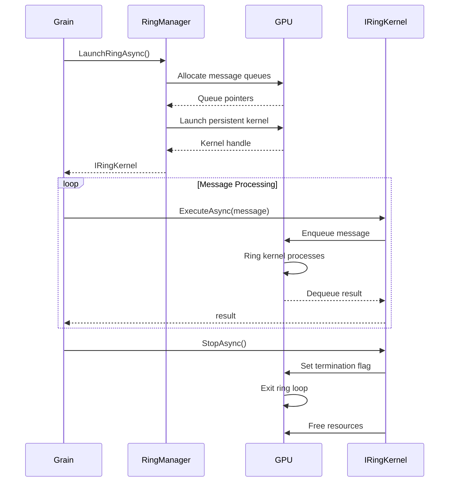

# Architecture Overview

This document provides a comprehensive overview of Orleans.GpuBridge.Core's architecture, design decisions, and internal components.

## Table of Contents

- [System Architecture](#system-architecture)
- [Component Layers](#component-layers)
- [Core Components](#core-components)
- [GPU Backend Abstraction](#gpu-backend-abstraction)
- [Placement Strategies](#placement-strategies)
- [Memory Management](#memory-management)
- [Ring Kernel Lifecycle](#ring-kernel-lifecycle)
- [Design Decisions](#design-decisions)

## System Architecture

Orleans.GpuBridge.Core is built as a layered architecture integrating with Microsoft Orleans:

```
┌──────────────────────────────────────────────────────────┐
│                 Application Layer                        │
│  - Business Logic (C#)                                   │
│  - Grain Implementations                                 │
│  - Type-safe Interfaces                                  │
└──────────────────────────────────────────────────────────┘
                         │
┌──────────────────────────────────────────────────────────┐
│           Orleans.GpuBridge Abstractions                 │
│  - IGpuBridge, IGpuKernel<TIn,TOut>                    │
│  - [GpuAccelerated], [RingKernel] Attributes            │
│  - GpuPipeline<T> Fluent API                            │
│  - Temporal Clock Interfaces (HLC, Vector Clocks)       │
└──────────────────────────────────────────────────────────┘
                         │
┌──────────────────────────────────────────────────────────┐
│            Orleans.GpuBridge Runtime                     │
│  ┌────────────────┬──────────────┬───────────────────┐  │
│  │ KernelCatalog  │ DeviceBroker │ PlacementStrategy │  │
│  ├────────────────┼──────────────┼───────────────────┤  │
│  │ RingManager    │ MemoryPool   │ TemporalClocks    │  │
│  └────────────────┴──────────────┴───────────────────┘  │
└──────────────────────────────────────────────────────────┘
                         │
┌──────────────────────────────────────────────────────────┐
│              Orleans Distributed Runtime                 │
│  - Virtual Actor Model (Grains)                         │
│  - Location Transparency                                │
│  - Automatic Failover & Activation                      │
│  - Streaming & Persistence                              │
└──────────────────────────────────────────────────────────┘
                         │
┌──────────────────────────────────────────────────────────┐
│            GPU Backend Abstraction Layer                 │
│  ┌──────────────┬────────────┬────────────┐            │
│  │ DotCompute   │ ILGPU      │ CPU        │            │
│  │ (CUDA/ROCm)  │ (IL→GPU)   │ (Fallback) │            │
│  └──────────────┴────────────┴────────────┘            │
└──────────────────────────────────────────────────────────┘
                         │
┌──────────────────────────────────────────────────────────┐
│                  Hardware Layer                          │
│  - NVIDIA GPUs (CUDA 12.0+)                             │
│  - AMD GPUs (ROCm 5.0+)                                 │
│  - Intel GPUs (oneAPI - future)                         │
└──────────────────────────────────────────────────────────┘
```

## Component Layers

### 1. Abstractions Layer

**Purpose**: Define contracts and interfaces for GPU acceleration

**Key Types**:

```csharp
// Core bridge interface
public interface IGpuBridge
{
    Task<TOut> ExecuteKernelAsync<TIn, TOut>(string kernelId, TIn input);
    IReadOnlyList<IGpuDevice> GetAvailableDevices();
}

// Kernel execution interface
public interface IGpuKernel<TIn, TOut> : IDisposable
{
    Task<TOut> ExecuteAsync(TIn input);
}

// Ring kernel interface (persistent execution)
public interface IRingKernel<TIn, TOut> : IGpuKernel<TIn, TOut>
{
    Task StartAsync(); // Launch ring kernel
    Task StopAsync();  // Terminate ring kernel
}

// Temporal clock interfaces
public interface IHybridLogicalClock
{
    HLCTimestamp Now();
    void Update(HLCTimestamp remote);
}

public interface IVectorClock
{
    void Increment(string actorId);
    bool HappenedBefore(IVectorClock other);
}
```

**Attributes**:

```csharp
// Mark grain as GPU-accelerated
[AttributeUsage(AttributeTargets.Class)]
public class GpuAcceleratedAttribute : Attribute
{
    public GpuMode Mode { get; set; } = GpuMode.Offload;
    public string? PreferredDevice { get; set; }
}

// Inject GPU kernel
[AttributeUsage(AttributeTargets.Field | AttributeTargets.Property)]
public class GpuKernelAttribute : Attribute
{
    public string KernelId { get; }
    public GpuKernelAttribute(string kernelId) => KernelId = kernelId;
}

// Inject ring kernel
[AttributeUsage(AttributeTargets.Field | AttributeTargets.Property)]
public class RingKernelAttribute : GpuKernelAttribute
{
    public RingKernelAttribute(string kernelId) : base(kernelId) { }
}
```

### 2. Runtime Layer

**Purpose**: Implement GPU integration with Orleans runtime

#### KernelCatalog

Manages kernel registration and resolution:

```csharp
public class KernelCatalog : IKernelCatalog
{
    private readonly ConcurrentDictionary<string, KernelRegistration> _kernels;
    private readonly IDeviceBroker _deviceBroker;

    public void RegisterKernel<TIn, TOut>(
        string kernelId,
        Func<IGpuDevice, IGpuKernel<TIn, TOut>> factory)
    {
        var registration = new KernelRegistration(kernelId, factory);
        _kernels[kernelId] = registration;
    }

    public IGpuKernel<TIn, TOut> ResolveKernel<TIn, TOut>(
        string kernelId,
        IGpuDevice? device = null)
    {
        device ??= _deviceBroker.GetDefaultDevice();
        var registration = _kernels[kernelId];
        return registration.CreateInstance<TIn, TOut>(device);
    }
}
```

#### DeviceBroker

Manages GPU device lifecycle:

```csharp
public class DeviceBroker : IDeviceBroker
{
    private readonly List<IGpuDevice> _devices;
    private readonly DeviceLoadBalancer _loadBalancer;

    public DeviceBroker(GpuBridgeOptions options)
    {
        _devices = DiscoverDevices(options);
        _loadBalancer = new DeviceLoadBalancer(_devices);
    }

    public IGpuDevice GetDefaultDevice()
    {
        return _loadBalancer.SelectDevice();
    }

    public IGpuDevice? GetDeviceById(string deviceId)
    {
        return _devices.FirstOrDefault(d => d.Id == deviceId);
    }

    private List<IGpuDevice> DiscoverDevices(GpuBridgeOptions options)
    {
        var devices = new List<IGpuDevice>();

        // Discover CUDA devices
        devices.AddRange(CudaDeviceDiscovery.Discover());

        // Discover ROCm devices
        devices.AddRange(RocmDeviceDiscovery.Discover());

        // Add CPU fallback
        devices.Add(new CpuFallbackDevice());

        return devices;
    }
}
```

#### RingManager

Manages ring kernel lifecycle:

```csharp
public class RingManager : IRingManager
{
    private readonly ConcurrentDictionary<Guid, RingKernelState> _rings;

    public async Task<IRingKernel<TIn, TOut>> LaunchRingAsync<TIn, TOut>(
        string kernelId,
        IGpuDevice device)
    {
        var ringId = Guid.NewGuid();
        var messageQueue = new GpuMessageQueue<TIn>(device);
        var resultQueue = new GpuMessageQueue<TOut>(device);

        // Launch persistent kernel
        var kernel = await device.LaunchPersistentKernelAsync(
            kernelId,
            new[] { messageQueue.DevicePointer, resultQueue.DevicePointer }
        );

        var ring = new RingKernel<TIn, TOut>(kernel, messageQueue, resultQueue);
        _rings[ringId] = new RingKernelState(ring);

        return ring;
    }

    public async Task TerminateRingAsync(Guid ringId)
    {
        if (_rings.TryRemove(ringId, out var state))
        {
            await state.Kernel.StopAsync();
            state.Dispose();
        }
    }
}
```

### 3. BridgeFX Layer

**Purpose**: High-level pipeline API for batch processing

```csharp
public class GpuPipeline<TIn, TOut>
{
    private readonly IGrainFactory _grainFactory;
    private readonly string _kernelId;
    private int _batchSize = 1000;
    private int _maxConcurrency = 10;

    public static GpuPipeline<TIn, TOut> For(
        IGrainFactory grainFactory,
        string kernelId)
    {
        return new GpuPipeline<TIn, TOut>(grainFactory, kernelId);
    }

    public GpuPipeline<TIn, TOut> WithBatchSize(int size)
    {
        _batchSize = size;
        return this;
    }

    public GpuPipeline<TIn, TOut> WithMaxConcurrency(int max)
    {
        _maxConcurrency = max;
        return this;
    }

    public async Task<TOut[]> ExecuteAsync(TIn[] data)
    {
        // Partition data into batches
        var batches = data.Chunk(_batchSize).ToArray();

        // Process batches concurrently
        var tasks = batches.Select(async (batch, index) =>
        {
            var grain = _grainFactory.GetGrain<IGpuBatchGrain>(index);
            return await grain.ProcessBatchAsync(_kernelId, batch);
        });

        var results = await Task.WhenAll(tasks);
        return results.SelectMany(r => r).ToArray();
    }
}
```

### 4. Grains Layer

**Purpose**: Pre-built grain implementations for common patterns

```csharp
[GpuAccelerated(Mode = GpuMode.Native)]
public class GpuResidentGrain<TState> : Grain, IGpuResidentGrain<TState>
    where TState : new()
{
    [RingKernel("kernels/StateManager")]
    private IRingKernel<StateCommand, StateResponse> _kernel;

    private TState _state = new();

    public override async Task OnActivateAsync(CancellationToken ct)
    {
        // Initialize ring kernel with GPU-resident state
        await _kernel.StartAsync();
        await _kernel.ExecuteAsync(new InitCommand { State = _state });
        await base.OnActivateAsync(ct);
    }

    public async Task<TResult> QueryAsync<TResult>(Func<TState, TResult> query)
    {
        var response = await _kernel.ExecuteAsync(
            new QueryCommand { Query = query }
        );
        return (TResult)response.Result;
    }

    public async Task UpdateAsync(Action<TState> update)
    {
        await _kernel.ExecuteAsync(
            new UpdateCommand { Update = update }
        );
    }

    public override async Task OnDeactivateAsync(DeactivationReason reason, CancellationToken ct)
    {
        // Terminate ring kernel
        await _kernel.StopAsync();
        await base.OnDeactivateAsync(reason, ct);
    }
}
```

## GPU Backend Abstraction

### DotCompute Backend

**Purpose**: Unified API for CUDA and ROCm

```csharp
public interface IDotComputeDevice : IGpuDevice
{
    Task<T[]> AllocateAsync<T>(int count) where T : unmanaged;
    Task CopyToDeviceAsync<T>(T[] hostData, T[] deviceData) where T : unmanaged;
    Task CopyToHostAsync<T>(T[] deviceData, T[] hostData) where T : unmanaged;
    Task<IDotComputeKernel> LoadKernelAsync(string ptxPath, string entryPoint);
}

public interface IDotComputeKernel : IDisposable
{
    Task LaunchAsync(Dim3 gridDim, Dim3 blockDim, params object[] args);
    Task LaunchPersistentAsync(Dim3 gridDim, Dim3 blockDim, params object[] args);
}
```

### ILGPU Backend

**Purpose**: Compile C# to GPU code

```csharp
public class ILGPUBackend : IGpuBackend
{
    private readonly Context _context;
    private readonly Accelerator _accelerator;

    public ILGPUBackend()
    {
        _context = Context.CreateDefault();
        _accelerator = _context.GetPreferredDevice(preferCPU: false)
                               .CreateAccelerator(_context);
    }

    public IGpuKernel<TIn, TOut> CompileKernel<TIn, TOut>(
        Expression<Action<Index1D, TIn, TOut>> kernelFunc)
    {
        var kernel = _accelerator.LoadAutoGroupedStreamKernel(kernelFunc);
        return new ILGPUKernel<TIn, TOut>(kernel, _accelerator);
    }
}
```

## Placement Strategies

### GPU-Aware Placement

Orleans.GpuBridge.Core extends Orleans placement strategies for GPU-aware grain placement:

```csharp
[Serializable]
public class GpuAwarePlacement : PlacementStrategy
{
    public static GpuAwarePlacement Singleton { get; } = new();
}

public class GpuAwarePlacementDirector : IPlacementDirector
{
    private readonly IDeviceBroker _deviceBroker;

    public Task<SiloAddress> OnAddActivation(
        PlacementStrategy strategy,
        PlacementTarget target,
        IPlacementContext context)
    {
        // Find silo with available GPU capacity
        var silos = context.GetCompatibleSilos(target);

        var bestSilo = silos
            .Select(s => new
            {
                Silo = s,
                GpuLoad = GetGpuLoad(s),
                QueueDepth = GetQueueDepth(s)
            })
            .OrderBy(x => x.GpuLoad)
            .ThenBy(x => x.QueueDepth)
            .First();

        return Task.FromResult(bestSilo.Silo);
    }

    private double GetGpuLoad(SiloAddress silo)
    {
        // Query GPU utilization via metrics
        return _deviceBroker.GetDeviceForSilo(silo)?.Utilization ?? 1.0;
    }
}
```

## Memory Management

### GPU Memory Pool

```csharp
public class GpuMemoryPool : IDisposable
{
    private readonly IGpuDevice _device;
    private readonly ConcurrentBag<MemoryBlock> _availableBlocks;
    private readonly List<MemoryBlock> _allocatedBlocks;

    public async Task<GpuBuffer<T>> AllocateAsync<T>(int count)
        where T : unmanaged
    {
        var size = count * Marshal.SizeOf<T>();

        // Try to reuse existing block
        if (_availableBlocks.TryTake(out var block) && block.Size >= size)
        {
            return new GpuBuffer<T>(block, count);
        }

        // Allocate new block
        var newBlock = await _device.AllocateAsync(size);
        _allocatedBlocks.Add(newBlock);
        return new GpuBuffer<T>(newBlock, count);
    }

    public void Release<T>(GpuBuffer<T> buffer) where T : unmanaged
    {
        _availableBlocks.Add(buffer.Block);
    }

    public void Dispose()
    {
        foreach (var block in _allocatedBlocks)
        {
            block.Dispose();
        }
    }
}
```

### Unified Memory

For GPU-native actors, unified memory simplifies data sharing:

```csharp
public class UnifiedMemoryAllocator
{
    public unsafe T* AllocateUnified<T>(int count) where T : unmanaged
    {
        void* ptr;
        cudaMallocManaged(&ptr, count * sizeof(T), cudaMemAttachGlobal);
        return (T*)ptr;
    }

    public unsafe void Prefetch<T>(T* ptr, int count, int deviceId)
        where T : unmanaged
    {
        cudaMemPrefetchAsync(ptr, count * sizeof(T), deviceId, stream: 0);
    }
}
```

## Ring Kernel Lifecycle

### Launch Sequence



### GPU-Side Implementation

```cuda
// Ring kernel implementation
__global__ void ring_kernel(
    MessageQueue<Input>* input_queue,
    MessageQueue<Output>* output_queue,
    ActorState* state,
    volatile bool* terminate_flag)
{
    while (!*terminate_flag) {
        // Non-blocking dequeue
        Input msg;
        if (!input_queue->try_dequeue(&msg)) {
            continue; // No message, keep polling
        }

        // Process message
        Output result = process_message(msg, state);

        // Enqueue result
        output_queue->enqueue(result);
    }
}
```

## Design Decisions

### 1. Why Orleans?

Orleans provides:
- **Virtual Actor Model** - Simplified distributed programming
- **Location Transparency** - Actors accessible anywhere
- **Automatic Failover** - Built-in fault tolerance
- **Streaming Support** - Reactive event processing
- **Production-Proven** - Used by Microsoft, Halo, and others

### 2. Why CPU Fallback?

CPU fallback enables:
- **Testing without GPU** - Unit tests on CI servers
- **Graceful Degradation** - Continue operation on GPU failure
- **Development Flexibility** - Prototype without GPU hardware
- **Hybrid Workloads** - Some grains on CPU, some on GPU

### 3. Why Ring Kernels?

Ring kernels provide:
- **Zero Launch Overhead** - Kernel already running
- **Persistent State** - State never leaves GPU
- **Sub-microsecond Latency** - 100-500ns message processing
- **High Throughput** - 2M messages/second per actor

### 4. Why Multiple Backends?

Multiple backends provide:
- **Vendor Independence** - Support NVIDIA and AMD
- **Optimization Options** - Choose best backend per workload
- **Future-Proofing** - Easy to add new backends (Intel, Apple)

## Performance Considerations

### Batch Size Optimization

```csharp
// Too small: High overhead
batchSize = 10; // 1000 kernel launches/second

// Too large: High latency
batchSize = 1_000_000; // 1 launch/second, high memory

// Optimal: Balance throughput and latency
batchSize = 10_000; // 100 launches/second, good GPU utilization
```

### Memory Transfer Overhead

```
Operation                      | Time
------------------------------|-------
CPU→GPU transfer (1MB)        | 50μs
GPU→CPU transfer (1MB)        | 50μs
GPU computation (1M ops)      | 100μs
Ring kernel message (100B)    | 100ns (no transfer!)
```

**Lesson**: Minimize CPU↔GPU transfers. Keep data on GPU with ring kernels.

## Next Steps

- **[Getting Started](getting-started.md)** - Build your first GPU grain
- **[API Reference](../api/index.md)** - Complete API documentation
- **[GPU-Native Actors](gpu-actors/introduction/README.md)** - Advanced patterns
- **[Temporal Correctness](temporal/introduction/README.md)** - HLC and Vector Clocks

---

[← Back to Concepts](concepts.md) | [API Reference →](../api/index.md)
