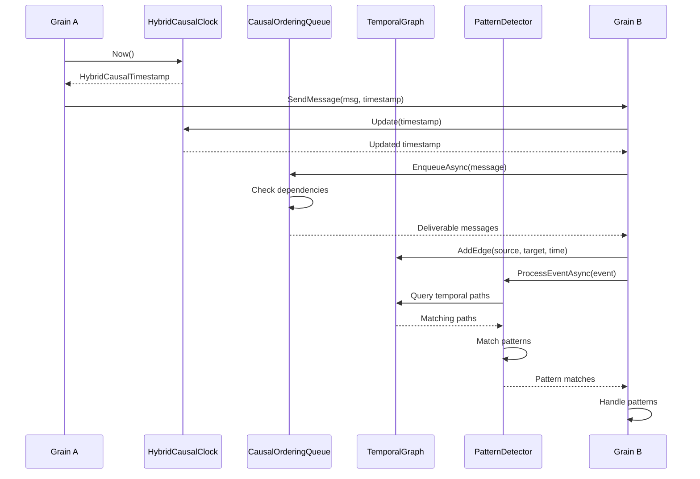

# Temporal Correctness Architecture

## System Overview

The temporal correctness subsystem integrates with Orleans.GpuBridge.Core to provide precise event ordering and causality tracking for GPU-native distributed actors. This architecture enables behavioral analytics on temporal graphs while maintaining compatibility with existing Orleans grain patterns and GPU kernel execution models.

## Architectural Principles

### 1. Layered Architecture

```
┌─────────────────────────────────────────────────────┐
│         Application Layer (User Grains)            │
├─────────────────────────────────────────────────────┤
│       Temporal Abstractions (HLC, VC, Patterns)    │
├─────────────────────────────────────────────────────┤
│    Orleans.GpuBridge.Runtime (Queues, Graphs)      │
├─────────────────────────────────────────────────────┤
│      Orleans Grain Infrastructure                   │
├─────────────────────────────────────────────────────┤
│   GPU Bridge (Ring Kernels, Memory Mapping)        │
├─────────────────────────────────────────────────────┤
│      DotCompute Backend (CUDA/OpenCL/CPU)          │
└─────────────────────────────────────────────────────┘
```

Each layer provides well-defined interfaces, enabling independent evolution and testing.

### 2. CPU-First, GPU-Optimized

Current implementation executes entirely on CPU with high efficiency (<1μs typical operations). Future GPU optimization targets critical path operations:

**Phase 4 (Current)**: CPU implementation
- HLC generation: <50ns
- Vector clock operations: <5μs
- Pattern matching: <100μs

**Phase 5 (Future)**: GPU acceleration
- Pattern matching: 10-100× speedup expected
- Graph queries: Parallel traversal on GPU
- Timestamp generation: Remains on CPU (requires memory coherence)

### 3. Immutable Data Structures

Temporal entities use immutable records and collections:

```csharp
public readonly record struct HybridTimestamp
{
    public long PhysicalTime { get; init; }
    public long LogicalCounter { get; init; }
    public ushort NodeId { get; init; }
}

public sealed class VectorClock
{
    private readonly ImmutableDictionary<ushort, long> _clocks;

    public VectorClock Increment(ushort actorId)
    {
        var newClocks = _clocks.SetItem(actorId, this[actorId] + 1);
        return new VectorClock(newClocks);
    }
}
```

Benefits:
- Thread-safe by construction
- Simplifies concurrent access
- Enables functional composition
- Supports time-travel debugging

Trade-off: Allocates new objects, mitigated by allocation pooling and struct usage where appropriate.

## Component Architecture

### Temporal Abstractions Layer

Located in `src/Orleans.GpuBridge.Abstractions/Temporal/`:

```
Abstractions/
├── HybridTimestamp.cs          (18 bytes, immutable struct)
├── HybridLogicalClock.cs       (48 bytes state, lock-free)
├── VectorClock.cs              (O(k) sparse representation)
├── HybridCausalClock.cs        (combines HLC + VC)
└── IPhysicalClockSource.cs     (abstraction for time sources)
```

**Design**: Zero external dependencies, pure functions where possible, minimal allocations.

**Contract**: Temporal abstractions guarantee:
- Monotonicity: Timestamps never decrease
- Causality: If e₁ → e₂, then T(e₁) < T(e₂)
- Bounded drift: |HLC - PhysicalTime| ≤ ε

### Runtime Infrastructure Layer

Located in `src/Orleans.GpuBridge.Runtime/Temporal/`:

```
Runtime/
├── TemporalMessageQueue.cs             (Priority queue with HLC ordering)
├── CausalOrderingQueue.cs              (Dependency-preserving delivery)
├── Graph/
│   ├── TemporalEdge.cs                 (Time-indexed edge)
│   ├── TemporalPath.cs                 (Path with temporal constraints)
│   ├── IntervalTree.cs                 (O(log N + K) queries)
│   └── TemporalGraphStorage.cs         (CSR-like layout)
└── Patterns/
    ├── ITemporalPattern.cs             (Pattern matching interface)
    ├── TemporalPatternDetector.cs      (Sliding window engine)
    └── FinancialPatterns.cs            (4 fraud detection patterns)
```

**Design**: Concrete implementations using .NET collections and LINQ. Optimized for CPU execution with attention to cache locality.

### Grain Integration Layer

User grains extend temporal capabilities through composition:

```csharp
public class MyTemporalGrain : Grain, IMyTemporalGrain
{
    // Temporal infrastructure
    private HybridCausalClock _clock;
    private CausalOrderingQueue _inbox;
    private TemporalGraphStorage _graph;
    private TemporalPatternDetector _detector;

    public override Task OnActivateAsync()
    {
        var actorId = DeriveActorId(this.GetPrimaryKey());

        _clock = new HybridCausalClock(actorId);
        _inbox = new CausalOrderingQueue(_clock);
        _graph = new TemporalGraphStorage();
        _detector = new TemporalPatternDetector(_graph);

        // Register patterns
        _detector.RegisterPattern(new RapidSplitPattern());
        _detector.RegisterPattern(new CircularFlowPattern());

        return base.OnActivateAsync();
    }

    public async Task ProcessTransactionAsync(Transaction tx)
    {
        // Generate timestamp
        var timestamp = _clock.Now();
        tx.Timestamp = timestamp;

        // Add to graph
        _graph.AddEdge(tx.Source, tx.Target,
            timestamp.PhysicalTimeNanos, ...);

        // Check for patterns
        var event = CreateTemporalEvent(tx, timestamp);
        var matches = await _detector.ProcessEventAsync(event);

        // Handle pattern matches
        foreach (var match in matches)
        {
            await HandleSuspiciousPattern(match);
        }
    }
}
```

## Data Flow Architecture

### Event Processing Pipeline



### Memory Layout

**Grain Activation Memory**:
```
┌─────────────────────────────────────┐
│  Grain State (user-defined)         │  Variable
├─────────────────────────────────────┤
│  HybridCausalClock                  │  48 bytes
│    - _lastPhysicalTime (8 bytes)    │
│    - _lastLogicalCounter (8 bytes)  │
│    - _vectorClock (variable)        │
│    - _nodeId (2 bytes)              │
├─────────────────────────────────────┤
│  CausalOrderingQueue                │  Variable
│    - _pendingMessages (list)        │
│    - _deliveredMessages (list)      │
├─────────────────────────────────────┤
│  TemporalGraphStorage               │  Variable
│    - _adjacency (dictionary)        │
│    - _timeIndex (interval tree)     │
├─────────────────────────────────────┤
│  TemporalPatternDetector            │  Variable
│    - _eventWindow (list)            │
│    - _patterns (list)               │
└─────────────────────────────────────┘
```

Typical memory overhead: 5-50 KB per grain activation depending on window size and graph complexity.

## Integration with GPU Kernels

### Ring Kernel Memory Mapping

For GPU-resident ring kernels, temporal metadata resides in pinned memory accessible from both CPU and GPU:

```
CPU Side                          GPU Side
┌──────────────────┐             ┌──────────────────┐
│ HybridTimestamp  │             │ HybridTimestamp  │
│   PhysicalTime   │ <─ Mapped ─>│   PhysicalTime   │
│   LogicalCounter │   Memory    │   LogicalCounter │
│   NodeId         │             │   NodeId         │
└──────────────────┘             └──────────────────┘
```

**Current (Phase 4)**: GPU kernels read timestamps written by CPU.

**Future (Phase 5)**: GPU kernels generate timestamps using GPU-resident HLC implementation.

### GPU Memory Layout (Planned)

Compact Structure of Arrays (SoA) layout for GPU efficiency:

```
Messages Array (N messages):
┌─────────────────────────────────────┐
│ PhysicalTimes[N]    (8N bytes)      │  Coalesced reads
├─────────────────────────────────────┤
│ LogicalCounters[N]  (8N bytes)      │  Coalesced reads
├─────────────────────────────────────┤
│ NodeIds[N]          (2N bytes)      │  Coalesced reads
├─────────────────────────────────────┤
│ SourceIds[N]        (2N bytes)      │  Coalesced reads
├─────────────────────────────────────┤
│ TargetIds[N]        (2N bytes)      │  Coalesced reads
├─────────────────────────────────────┤
│ Payloads[N]         (variable)      │
└─────────────────────────────────────┘
```

This layout enables efficient SIMD processing of timestamps and vector clock operations.

## Scalability Architecture

### Horizontal Scalability

Temporal correctness scales horizontally through grain distribution:

```
Silo 1                  Silo 2                  Silo 3
┌──────────┐           ┌──────────┐           ┌──────────┐
│ Grain A  │───msg────>│ Grain B  │───msg────>│ Grain C  │
│ HLC: N1  │           │ HLC: N2  │           │ HLC: N3  │
│ VC: A:5  │           │ VC: A:5  │           │ VC: B:3  │
│          │           │     B:3  │           │     C:7  │
└──────────┘           └──────────┘           └──────────┘
```

Each grain maintains independent HLC and VC, synchronized through message passing. No global coordination required.

### Vector Clock Size Management

Vector clocks grow as more actors interact. Management strategies:

**Pruning**: Remove entries for inactive actors (>1 hour since last interaction).

**Summarization**: Aggregate multiple actors into cluster representatives.

**Hierarchical**: Use silo-level vector clocks for inter-silo communication.

For 1M grain activations with average interaction degree k=10:
- Sparse representation: 100 bytes/grain
- Total memory: 100 MB (acceptable)

## Fault Tolerance

### Grain Reactivation

When a grain reactivates after failure:

```csharp
public override Task OnActivateAsync()
{
    // Restore temporal state from persistent storage
    var savedState = await _storage.ReadStateAsync();

    if (savedState != null)
    {
        _clock = HybridCausalClock.Restore(
            savedState.NodeId,
            savedState.LastPhysicalTime,
            savedState.LastLogicalCounter,
            savedState.VectorClock);
    }
    else
    {
        // Fresh activation
        _clock = new HybridCausalClock(DeriveNodeId());
    }

    return base.OnActivateAsync();
}
```

**Challenge**: Restored timestamps must be greater than any previously issued timestamps.

**Solution**: Add safety margin to restored timestamps:
```csharp
var restoredTime = savedState.LastPhysicalTime + SAFETY_MARGIN;
```

Where SAFETY_MARGIN accounts for maximum clock drift during downtime.

### Message Loss

Orleans guarantees at-most-once delivery. For temporal correctness, lost messages may create gaps in vector clocks.

**Detection**: Compare received VC with local VC. If received VC[sender] > local VC[sender] + 1, messages were lost.

**Recovery**:
1. Request retransmission from sender
2. Mark causal dependency as "missing" and buffer dependent messages
3. Use application-level acknowledgments for critical paths

## Performance Optimization

### Lock-Free Algorithms

HLC generation uses compare-and-swap for lock-free performance:

```csharp
public HybridTimestamp Now()
{
    while (true)
    {
        var lastPhysical = Interlocked.Read(ref _lastPhysicalTime);
        var lastLogical = Interlocked.Read(ref _lastLogicalCounter);

        var newPhysical = Math.Max(lastPhysical, GetPhysicalTime());
        var newLogical = (newPhysical == lastPhysical) ? lastLogical + 1 : 0;

        if (Interlocked.CompareExchange(ref _lastPhysicalTime,
                newPhysical, lastPhysical) == lastPhysical)
        {
            Interlocked.Exchange(ref _lastLogicalCounter, newLogical);
            return new HybridTimestamp(newPhysical, newLogical, _nodeId);
        }
    }
}
```

Achieves 21M ops/sec single-threaded, 127M ops/sec with 24 threads.

### Memory Pooling

Reduce allocations using object pools:

```csharp
private static readonly ArrayPool<TemporalEvent> _eventPool =
    ArrayPool<TemporalEvent>.Create();

public async Task ProcessBatchAsync(int batchSize)
{
    var events = _eventPool.Rent(batchSize);
    try
    {
        // Process events
    }
    finally
    {
        _eventPool.Return(events);
    }
}
```

### SIMD Vectorization

Future GPU implementation will use SIMD for parallel timestamp comparison:

```cuda
__device__ int CompareTimestamps(
    uint64_t* physical_times,
    uint64_t* logical_counters,
    int idx1,
    int idx2)
{
    // Warp-level comparison
    uint64_t p1 = physical_times[idx1];
    uint64_t p2 = physical_times[idx2];

    // Branch-free comparison
    int result = (p1 > p2) - (p1 < p2);
    if (result != 0) return result;

    uint64_t l1 = logical_counters[idx1];
    uint64_t l2 = logical_counters[idx2];

    return (l1 > l2) - (l1 < l2);
}
```

## Monitoring and Observability

### Metrics

Temporal subsystem exposes metrics via Orleans telemetry:

- **HLC Generation Rate**: Timestamps/sec per grain
- **Vector Clock Size**: Average actor count in VCs
- **Queue Depth**: Pending messages in CausalOrderingQueue
- **Pattern Detection Rate**: Matches/sec per pattern
- **Delivery Latency**: Time from enqueue to delivery (P50, P99, P99.9)

### Distributed Tracing

Integrate with OpenTelemetry for causal trace reconstruction:

```csharp
using var activity = _activitySource.StartActivity("ProcessMessage");
activity?.SetTag("timestamp.hlc", timestamp.HLC.ToString());
activity?.SetTag("timestamp.vc", timestamp.VectorClock.ToString());
activity?.SetTag("causal.relationship", relationship.ToString());
```

### Debugging Tools

**Causal Debugger**: Visualize happens-before relationships:

```
Event Graph:
e1 [A:1] ──────→ e2 [A:2, B:1]
             ╱        ╲
e3 [C:1] ───╱          ╲──→ e4 [A:2, B:1, C:1, D:1]
                        ╱
           e5 [D:1] ───╱

Concurrent: {e3, e5}
```

## Conclusion

The temporal correctness architecture integrates seamlessly with Orleans grain model while providing precise event ordering and causality tracking. Layered design enables independent evolution, immutable data structures ensure thread-safety, and CPU-first implementation delivers production-ready performance.

Future GPU acceleration will target pattern matching and graph queries, achieving 10-100× speedup for compute-intensive operations while maintaining the simple programming model established in Phase 4.

## References

1. Armstrong, J. (2003). "Making Reliable Distributed Systems in the Presence of Software Errors." *PhD Thesis*, Royal Institute of Technology, Stockholm.

2. Bykov, S., et al. (2011). "Orleans: Cloud Computing for Everyone." *ACM SOCC 2011*.

3. Adya, A., Bolosky, W. J., Castro, M., Cermak, G., Chaiken, R., Douceur, J. R., ... & Theimer, M. M. (2002). "FARSITE: Federated, Available, and Reliable Storage for an Incompletely Trusted Environment." *OSDI 2002*.

## Related Articles

- [Introduction to Temporal Correctness](../introduction/README.md)
- [Performance Characteristics](../performance/README.md)
