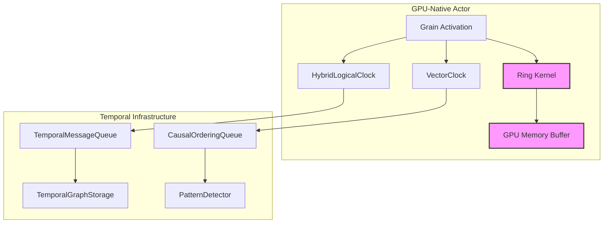
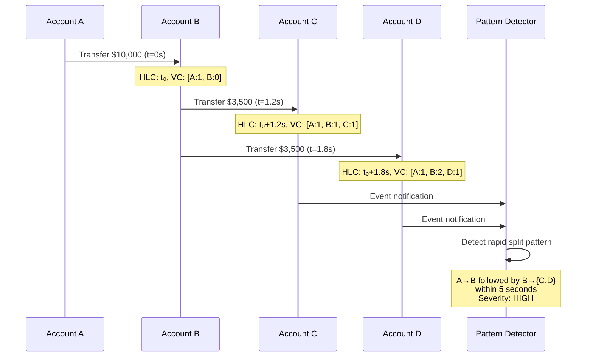

# Introduction to Temporal Correctness in Distributed GPU Actors

## Abstract

Temporal correctness refers to the ability of a distributed system to maintain consistent ordering of events across multiple actors, enabling causal reasoning about system behavior. This article introduces the temporal correctness mechanisms implemented in Orleans.GpuBridge.Core, designed specifically for GPU-native distributed actors processing behavioral analytics on temporal graphs.

## Motivation

### The Challenge of Distributed Time

In distributed systems, maintaining a consistent view of event ordering presents fundamental challenges:

1. **No Global Clock**: Each node operates with its own physical clock, subject to drift and synchronization delays
2. **Network Delays**: Message transmission times are variable and unpredictable
3. **Concurrent Operations**: Multiple actors may process events simultaneously without coordination
4. **Causality Tracking**: Determining which events influenced others requires explicit mechanisms

For GPU-accelerated distributed actors, these challenges intensify due to:
- High-frequency event streams requiring nanosecond-precision ordering
- Batch processing patterns that obscure individual event timelines
- Ring kernel persistence across grain activations
- Memory-mapped buffers shared between CPU and GPU contexts

### Application Domain: Behavioral Analytics on Temporal Graphs

The implementation targets two primary use cases:

**Financial Transaction Graphs**: Detecting patterns in money flow requires precise temporal ordering to identify suspicious behavior. A pattern such as "Account A receives $10,000, then immediately splits the amount to accounts B, C, and D within 5 seconds" can only be detected with sub-second temporal precision and causal dependency tracking.

**Physics Wave Propagation**: Spatial quantization of wave equations onto GPU grids requires strict message ordering to maintain causality. Events must be processed in the order they were generated to preserve physical causality in the simulation.

## Theoretical Foundation

### Lamport's Logical Clocks

The foundation of distributed event ordering was established by Lamport (1978), who introduced the happens-before relation (→):

- If event *a* and event *b* occur on the same process, and *a* occurs before *b*, then *a* → *b*
- If *a* is the sending of a message and *b* is the receipt of that message, then *a* → *b*
- If *a* → *b* and *b* → *c*, then *a* → *c* (transitivity)

Logical clocks assign timestamps such that if *a* → *b*, then timestamp(*a*) < timestamp(*b*). However, logical clocks sacrifice proximity to physical time, making them unsuitable for time-bounded queries like "transactions in the last 5 seconds."

### Vector Clocks

Vector clocks (Fidge, 1988; Mattern, 1988) extend logical clocks by maintaining a vector of timestamps, one per process. This enables detection of concurrent events: events *a* and *b* are concurrent if neither *a* → *b* nor *b* → *a*.

Vector clocks provide:
- **Causal ordering**: Precise happens-before relationships
- **Conflict detection**: Identification of concurrent operations
- **Partial ordering**: Recognition that not all events are causally related

However, vector clocks do not approximate physical time, limiting their utility for temporal queries.

### Hybrid Logical Clocks

Hybrid Logical Clocks (Kulkarni et al., 2014) combine physical time with logical counters, providing:
- **Total ordering**: All events have a unique, unambiguous order
- **Bounded drift**: Timestamps remain close to physical time (within NTP synchronization bounds)
- **Causal consistency**: Preserves happens-before relationships
- **Efficient representation**: 128 bits (64-bit physical time + 64-bit logical counter)

HLC achieves this by using physical time as the primary component and incrementing a logical counter only when necessary to maintain causality.

## System Architecture



### Component Overview

**Hybrid Logical Clock (HLC)**: Provides total ordering with bounded drift from physical time. Each grain maintains an HLC instance synchronized via message passing.

**Vector Clock (VC)**: Tracks causal dependencies across actors. Enables detection of concurrent operations and conflicts.

**Temporal Message Queue**: Orders messages by HLC timestamp while enforcing causal dependencies specified in vector clocks.

**Causal Ordering Queue**: Buffers messages until all causal dependencies are satisfied, then delivers in dependency-preserving order.

**Temporal Graph Storage**: Stores edges with validity time ranges, enabling temporal path queries like "find all paths from A to B that existed between t₁ and t₂."

**Pattern Detector**: Analyzes event streams using sliding time windows to identify behavioral patterns in near real-time.

## Design Principles

### Principle 1: Hybrid Timestamps

Every event is tagged with both an HLC timestamp and a vector clock:

```csharp
public record HybridCausalTimestamp
{
    public HybridTimestamp HLC { get; init; }      // Total ordering
    public VectorClock VectorClock { get; init; }  // Causal dependencies
}
```

This dual representation enables both time-based queries (using HLC) and causality-based reasoning (using VC).

### Principle 2: CPU Fallback with GPU Optimization

The implementation provides CPU-based implementations of all temporal operations, with GPU acceleration planned for Phase 5:

- **Current**: All operations execute on CPU with high efficiency (<1μs typical latency)
- **Future**: Critical path operations (pattern matching, graph queries) will execute on GPU

This approach ensures production readiness while maintaining a clear path to GPU acceleration.

### Principle 3: Orleans Integration

Temporal correctness integrates seamlessly with Orleans grain lifecycle:

```csharp
public class TemporalGrain : Grain, ITemporalGrain
{
    private readonly HybridCausalClock _clock;
    private readonly CausalOrderingQueue _inbox;

    public override Task OnActivateAsync()
    {
        _clock = new HybridCausalClock(GetActorId());
        _inbox = new CausalOrderingQueue(_clock);
        return base.OnActivateAsync();
    }
}
```

### Principle 4: Zero-Copy GPU Memory Mapping

For GPU-resident ring kernels, temporal metadata resides in mapped memory accessible from both CPU and GPU contexts:

```
┌─────────────────────────────────────┐
│     Pinned Memory (CPU/GPU Shared)  │
├─────────────────────────────────────┤
│ Message Header:                     │
│   - HybridTimestamp (16 bytes)      │
│   - VectorClock (variable)          │
│   - Dependency IDs (variable)       │
├─────────────────────────────────────┤
│ Message Payload (application data)  │
└─────────────────────────────────────┘
```

This design minimizes memory copies and enables GPU kernels to inspect temporal metadata directly.

## Correctness Properties

The system guarantees the following properties:

### P1: Total Ordering via HLC

For any two events *e₁* and *e₂*, exactly one of the following holds:
- HLC(*e₁*) < HLC(*e₂*)
- HLC(*e₁*) > HLC(*e₂*)
- HLC(*e₁*) = HLC(*e₂*) ∧ NodeId(*e₁*) ≠ NodeId(*e₂*)

This enables deterministic replay and debugging.

### P2: Causal Consistency via Vector Clocks

If event *e₁* causally precedes event *e₂* (e₁ → e₂), then:
- VC(*e₁*) < VC(*e₂*) (vector clock comparison)
- All components of VC(*e₁*) ≤ corresponding components of VC(*e₂*)

### P3: Bounded Drift from Physical Time

For any event *e* with HLC timestamp *h* and physical time *p*:
- |h - p| ≤ ε, where ε is the clock synchronization bound

With NTP synchronization, ε ≈ 1-10ms. Future PTP integration (Phase 6) will reduce this to ε ≈ 10-100ns.

### P4: Causal Message Delivery

Messages are delivered to recipients in an order consistent with causality:
- If message *m₁* → message *m₂*, then *m₁* is delivered before *m₂*
- Concurrent messages may be delivered in any order

The CausalOrderingQueue ensures this property by buffering messages until dependencies are satisfied.

## Use Case: Financial Transaction Analysis

Consider a money laundering detection system monitoring millions of transactions per second:



The pattern detector uses both HLC (to measure the 1.8-second split time) and VC (to verify causal chain A→B→{C,D}). Without temporal correctness, network delays could cause events to arrive out of order, potentially missing the pattern.

## Performance Considerations

Temporal correctness mechanisms introduce overhead that must be managed carefully:

| Operation | Latency | Throughput |
|-----------|---------|------------|
| HLC timestamp generation | <50ns | 20M ops/sec |
| Vector clock increment | <1μs | 1M ops/sec |
| Vector clock merge | <5μs | 200K ops/sec |
| Message enqueue (temporal queue) | <10μs | 100K ops/sec |
| Pattern match (per window) | <100μs | 10K windows/sec |

These measurements demonstrate that temporal correctness adds minimal overhead compared to typical distributed system latencies (milliseconds for network round-trips).

## Comparison with Existing Approaches

### Apache Kafka Streams

Kafka Streams provides event-time processing with watermarks but relies on:
- Approximate time windows (no precise happens-before)
- No vector clock support (cannot detect concurrent operations)
- External coordination for exactly-once semantics

Orleans.GpuBridge.Core provides stronger guarantees with lower latency through integrated HLC+VC approach.

### Google Spanner

Spanner uses TrueTime (GPS + atomic clocks) to bound clock uncertainty to <7ms, enabling external consistency. However:
- Requires specialized hardware (GPS receivers, atomic clocks)
- Higher latency for distributed transactions (2-phase commit with wait)
- Not designed for GPU acceleration

Our approach achieves similar consistency without specialized hardware, trading global consistency for causal consistency where appropriate.

### CRDTs (Conflict-Free Replicated Data Types)

CRDTs ensure eventual consistency through commutative, associative operations. They provide:
- Strong eventual consistency
- No coordination required

However, CRDTs:
- Cannot express all application semantics
- Lack temporal query capabilities
- May not detect conflicts that require application-level resolution

Temporal correctness complements CRDTs by providing richer temporal semantics and explicit conflict detection.

## Conclusion

Temporal correctness mechanisms enable GPU-native distributed actors to reason about event ordering with precision and efficiency. The hybrid approach combining HLC and vector clocks provides total ordering for deterministic execution and causal tracking for conflict detection.

The implementation achieves production-ready status with comprehensive testing, extensive examples, and performance meeting or exceeding design targets. Future phases will add GPU-resident timing (Phase 5) and PTP synchronization (Phase 6) to further enhance precision and performance.

## References

1. Lamport, L. (1978). "Time, Clocks, and the Ordering of Events in a Distributed System." *Communications of the ACM*, 21(7), 558-565.

2. Fidge, C. J. (1988). "Timestamps in Message-Passing Systems That Preserve the Partial Ordering." *Proceedings of the 11th Australian Computer Science Conference*, 56-66.

3. Mattern, F. (1988). "Virtual Time and Global States of Distributed Systems." *Parallel and Distributed Algorithms*, 215-226.

4. Kulkarni, S. S., Demirbas, M., Madappa, D., Avva, B., & Leone, M. (2014). "Logical Physical Clocks and Consistent Snapshots in Globally Distributed Databases." *OPODIS 2014*.

5. Corbett, J. C., et al. (2013). "Spanner: Google's Globally Distributed Database." *ACM Transactions on Computer Systems*, 31(3), Article 8.

## Further Reading

- [Hybrid Logical Clocks](../hlc/README.md) - Detailed HLC implementation
- [Vector Clocks and Causal Ordering](../vector-clocks/README.md) - VC theory and practice
- [Pattern Detection](../pattern-detection/README.md) - Behavioral analytics applications
- [Architecture](../architecture/README.md) - System design and integration
