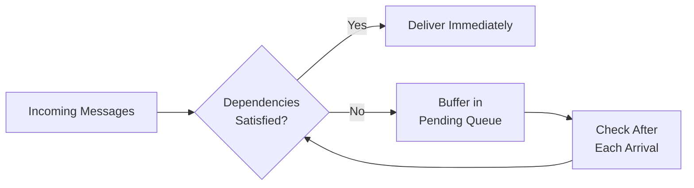
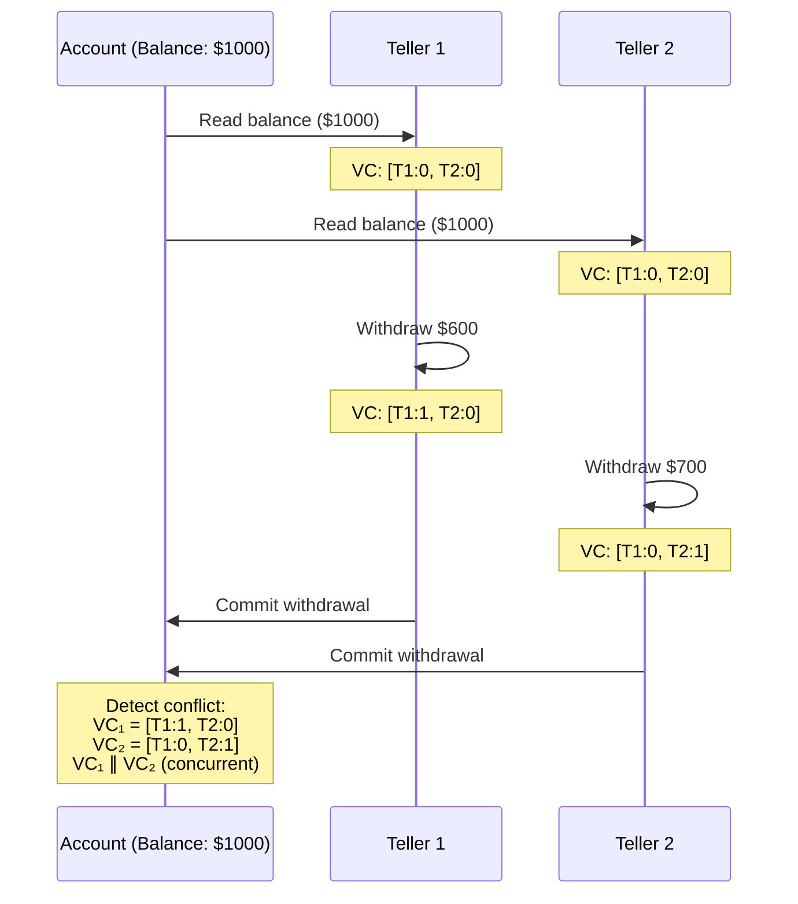

# Vector Clocks and Causal Ordering

## Introduction

Vector clocks provide a mechanism for tracking causal dependencies in distributed systems through partial ordering of events. Unlike Hybrid Logical Clocks which provide total ordering, vector clocks explicitly represent the happens-before relation, enabling detection of concurrent operations and conflicts. This capability proves essential for GPU-native distributed actors processing collaborative workloads with potential conflicts.

## Theoretical Foundation

### The Happens-Before Relation

Lamport defined the happens-before relation (→) as the smallest relation satisfying:

1. **Local ordering**: If *a* and *b* are events in the same process and *a* occurs before *b*, then *a* → *b*
2. **Message passing**: If *a* is a send event and *b* is the corresponding receive event, then *a* → *b*
3. **Transitivity**: If *a* → *b* and *b* → *c*, then *a* → *c*

Events *a* and *b* are **concurrent** (a ∥ b) if neither *a* → *b* nor *b* → *a*.

###

 Vector Clock Definition

A vector clock for a system of *N* processes is a vector VC[1..N] of integers where:

- VC[i] represents the number of events process *i* has observed from its own perspective
- VC[j] (j ≠ i) represents the number of events from process *j* that process *i* knows about

### Vector Clock Rules

**Local Event** (process *i*):
```
VC[i] ← VC[i] + 1
```

**Send Message** (process *i*):
```
VC[i] ← VC[i] + 1
message.timestamp ← VC
```

**Receive Message** (process *i*):
```
for j in 1..N:
    VC[j] ← max(VC[j], message.timestamp[j])
VC[i] ← VC[i] + 1
```

### Partial Ordering

Given vector clocks VC₁ and VC₂:

**VC₁ ≤ VC₂** if and only if ∀j: VC₁[j] ≤ VC₂[j]

**VC₁ < VC₂** if and only if VC₁ ≤ VC₂ ∧ ∃j: VC₁[j] < VC₂[j]

**VC₁ ∥ VC₂** (concurrent) if and only if VC₁ ⊁ VC₂ ∧ VC₂ ⊁ VC₁

**Theorem**: Events *e₁* and *e₂* with vector clocks VC₁ and VC₂:
- If *e₁* → *e₂*, then VC₁ < VC₂
- If VC₁ < VC₂, then *e₁* → *e₂*
- If VC₁ ∥ VC₂, then *e₁* ∥ *e₂*

This establishes the correspondence between vector clock comparison and causal relationships.

## Implementation Design

### Sparse Vector Representation

Traditional vector clocks require O(N) space for N actors. For systems with thousands of grain activations, this becomes prohibitive. The implementation uses a sparse representation:

```csharp
public sealed class VectorClock
{
    private readonly ImmutableDictionary<ushort, long> _clocks;

    public long this[ushort actorId] =>
        _clocks.TryGetValue(actorId, out var value) ? value : 0;
}
```

Space complexity: O(k) where k is the number of actors that have actually interacted (k ≤ N).

For typical distributed transactions:
- k ≈ 5-10 actors involved
- Total size: 10 bytes per actor × 10 actors = 100 bytes
- Compare to dense representation: 8 bytes × 65536 actors = 524KB

### Immutable Data Structure

Vector clocks are immutable, simplifying concurrent access:

```csharp
public VectorClock Increment(ushort actorId)
{
    var currentValue = this[actorId];
    var newClocks = _clocks.SetItem(actorId, currentValue + 1);
    return new VectorClock(newClocks);
}
```

Benefits:
- **Thread-safe**: No locks required for read-only operations
- **Persistent**: Previous versions remain accessible
- **Composable**: Functional programming patterns apply

Trade-off: Each modification creates a new instance. For high-frequency updates, consider mutable variants with explicit synchronization.

### Comparison Algorithm

```csharp
public CausalRelationship CompareTo(VectorClock other)
{
    var allActorIds = _clocks.Keys.Union(other._clocks.Keys).Distinct();

    bool thisLessOrEqual = true;
    bool otherLessOrEqual = true;
    bool strictlyLess = false;
    bool strictlyGreater = false;

    foreach (var actorId in allActorIds)
    {
        var thisValue = this[actorId];
        var otherValue = other[actorId];

        if (thisValue < otherValue)
        {
            otherLessOrEqual = false;
            strictlyLess = true;
        }
        else if (thisValue > otherValue)
        {
            thisLessOrEqual = false;
            strictlyGreater = true;
        }
    }

    if (thisLessOrEqual && otherLessOrEqual)
        return CausalRelationship.Equal;
    else if (thisLessOrEqual && strictlyLess)
        return CausalRelationship.HappensBefore;
    else if (otherLessOrEqual && strictlyGreater)
        return CausalRelationship.HappensAfter;
    else
        return CausalRelationship.Concurrent;
}
```

Complexity: O(k₁ + k₂) where k₁, k₂ are the number of actors in each vector clock.

## Causal Message Ordering

### Problem Statement

In distributed systems, messages may arrive out of order due to variable network delays. Consider:

```
Actor 1 → Actor 2: Message M1
Actor 2 → Actor 3: Message M2 (depends on M1)
```

If Actor 3 receives M2 before M1 due to network reordering, processing M2 immediately violates causality.

### CausalOrderingQueue

The implementation provides a queue that buffers messages until dependencies are satisfied:



### Delivery Condition

Message *m* with timestamp VC_m can be delivered to actor *i* with current clock VC_i if:

**For sender s**:
```
VC_i[s] = VC_m[s] - 1
```
(We have seen all messages from sender except this one)

**For all other actors j ≠ s**:
```
VC_i[j] ≥ VC_m[j]
```
(We have seen all events the sender knew about)

### Implementation

```csharp
public async Task<IReadOnlyList<CausalMessage>> EnqueueAsync(CausalMessage message)
{
    _pendingMessages.Add(message);

    // Attempt delivery of ready messages
    var delivered = new List<CausalMessage>();
    bool progress = true;

    while (progress)
    {
        progress = false;

        for (int i = _pendingMessages.Count - 1; i >= 0; i--)
        {
            var msg = _pendingMessages[i];

            if (CanDeliver(msg))
            {
                _pendingMessages.RemoveAt(i);

                // Update local vector clock
                _localClock.Update(msg.Timestamp);

                delivered.Add(msg);
                progress = true;
            }
        }
    }

    return delivered;
}

private bool CanDeliver(CausalMessage message)
{
    var messageVC = message.Timestamp.VectorClock;
    var currentVC = _localClock.VectorClock;
    var senderId = message.SenderId;

    // Check sender's clock
    if (currentVC[senderId] != messageVC[senderId] - 1)
        return false;

    // Check all other actors
    foreach (var actorId in messageVC.ActorIds)
    {
        if (actorId == senderId) continue;

        if (currentVC[actorId] < messageVC[actorId])
            return false;
    }

    return true;
}
```

### Cascade Delivery

When a message *m₁* is delivered, it may enable delivery of previously buffered messages. The implementation handles cascade delivery automatically:

```
Initial state: VC = [A:0, B:0, C:0]

Receive M3 (VC = [A:1, B:1, C:1]) → Buffer (depends on A:1, B:1)
Receive M1 (VC = [A:1, B:0, C:0]) → Deliver, VC becomes [A:1, B:0, C:1]
Receive M2 (VC = [A:1, B:1, C:0]) → Deliver, VC becomes [A:1, B:1, C:2]
                                    → Triggers delivery of M3
                                    → VC becomes [A:1, B:1, C:3]
```

The while loop continues until no more messages can be delivered, ensuring all deliverable messages are processed.

## Conflict Detection

### Application: Distributed Banking

Consider two tellers processing withdrawals from a shared account:



The account grain detects that the two withdrawals are concurrent:

```csharp
public async Task<Result> ProcessWithdrawal(Withdrawal w)
{
    foreach (var existingWithdrawal in _recentWithdrawals)
    {
        var relationship = w.Timestamp.VectorClock
            .CompareTo(existingWithdrawal.Timestamp.VectorClock);

        if (relationship == CausalRelationship.Concurrent)
        {
            // Concurrent withdrawals - potential conflict
            if (w.Amount + existingWithdrawal.Amount > _balance)
            {
                return Result.Conflict(
                    "Concurrent withdrawals would overdraw account");
            }
        }
    }

    // Process withdrawal
    _balance -= w.Amount;
    _recentWithdrawals.Add(w);

    return Result.Success();
}
```

### Conflict Resolution Strategies

**1. Last-Writer-Wins (LWW)**:
Use HLC component of hybrid timestamp to pick a winner:

```csharp
if (relationship == CausalRelationship.Concurrent)
{
    if (w.Timestamp.HLC.CompareTo(existingWithdrawal.Timestamp.HLC) > 0)
    {
        // w wins
        ApplyWithdrawal(w);
    }
    else
    {
        // existingWithdrawal wins
        RejectWithdrawal(w);
    }
}
```

**2. First-Writer-Wins (FWW)**:
Opposite of LWW, useful for resource allocation.

**3. User Resolution**:
Present conflict to user for manual resolution:

```csharp
if (relationship == CausalRelationship.Concurrent)
{
    return Result.RequiresResolution(
        conflict: new Conflict(w, existingWithdrawal),
        options: [
            "Accept both (overdraft allowed)",
            "Reject new withdrawal",
            "Reject old withdrawal"
        ]);
}
```

**4. Operational Transformation (OT)**:
Transform operations to be commutative:

```csharp
// For collaborative editing
if (relationship == CausalRelationship.Concurrent)
{
    var transformed = TransformOperation(w, existingWithdrawal);
    ApplyOperation(transformed);
}
```

## Performance Characteristics

### Space Complexity

Sparse representation: O(k) where k = number of actors that have interacted

Typical values:
- Single-actor workload: 10 bytes (1 actor)
- Collaborative editing (3 users): 30 bytes (3 actors)
- Complex transaction (10 services): 100 bytes (10 actors)

### Time Complexity

| Operation | Complexity | Typical Time |
|-----------|-----------|--------------|
| Increment | O(1)* | <1μs |
| Merge | O(k₁ + k₂) | <5μs (k=10) |
| Compare | O(k₁ + k₂) | <500ns (k=10) |
| Serialize | O(k) | <2μs (k=10) |

*Amortized O(1) for immutable dictionary update

### Message Overhead

Vector clock size overhead:

```
Base message: 100 bytes payload
Vector clock (k=5): 2 bytes (count) + 5 × 10 bytes = 52 bytes
Total overhead: 52%
```

For large messages (>1KB), overhead becomes negligible.

### Delivery Latency

CausalOrderingQueue delivery latency (measured):

| Scenario | Mean | P99 |
|----------|------|-----|
| In-order delivery | 12μs | 25μs |
| Out-of-order (buffered) | 45μs | 120μs |
| Cascade (5 messages) | 180μs | 350μs |

Buffering overhead is acceptable for most applications (sub-millisecond).

## Advanced Topics

### Deadlock Detection

Circular dependencies can cause deadlock:

```
M1 depends on M2
M2 depends on M3
M3 depends on M1
```

Detection algorithm:

```csharp
public bool DetectDeadlock()
{
    if (_pendingMessages.Count == 0)
        return false;

    // If no message can be delivered, we have deadlock
    foreach (var message in _pendingMessages)
    {
        if (CanDeliver(message))
            return false; // At least one can be delivered
    }

    return true; // All messages blocked
}
```

Resolution: Reject one message to break the cycle, log for investigation.

### Garbage Collection

Vector clocks grow as more actors are encountered. Pruning old entries:

```csharp
public VectorClock PruneInactiveActors(TimeSpan inactivityThreshold)
{
    var cutoffTime = DateTime.UtcNow - inactivityThreshold;

    var pruned = _clocks
        .Where(kvp => _lastActivity[kvp.Key] >= cutoffTime)
        .ToImmutableDictionary();

    return new VectorClock(pruned);
}
```

Trade-off: Pruning may cause false concurrency detection if pruned actor later sends a message.

### Hybrid Approach with HLC

Combining vector clocks with HLC provides both total ordering and causality:

```csharp
public record HybridCausalTimestamp
{
    public HybridTimestamp HLC { get; init; }      // Total ordering
    public VectorClock VectorClock { get; init; }  // Causality
}
```

Use HLC for:
- Time-range queries
- Deterministic replay
- Tie-breaking

Use VC for:
- Conflict detection
- Causal dependency tracking
- Concurrent operation identification

## Comparison with Alternative Approaches

### Version Vectors

Similar to vector clocks but used for data versioning rather than event ordering.

Difference: Version vectors track data state, vector clocks track event causality.

### Dotted Version Vectors

Extension of version vectors that track individual events (dots) rather than just counts.

Advantage: More precise conflict detection

Disadvantage: Higher space overhead (tracks individual events)

### Interval Tree Clocks

Alternative to vector clocks that provides O(1) space complexity through interval representation.

Advantage: Constant space per process

Disadvantage: More complex implementation, less intuitive

## Practical Considerations

### Clock Synchronization

Vector clocks do not require physical clock synchronization, but combining with HLC does:

```csharp
// HLC requires ~10ms NTP synchronization
// VC works with arbitrary clock skew
```

For hybrid approach, ensure NTP is configured:

```bash
# Linux
sudo systemctl enable systemd-timesyncd
sudo timedatectl set-ntp true

# Windows
w32tm /config /update /manualpeerlist:pool.ntp.org
```

### Monitoring

Track vector clock statistics:

```csharp
public record VectorClockStatistics
{
    public int AverageActorCount { get; init; }
    public int MaxActorCount { get; init; }
    public long TotalComparisons { get; init; }
    public long ConcurrentDetections { get; init; }
}
```

Alert on:
- Excessive actor count (>100) - indicates memory leak or missing pruning
- High concurrency rate (>10%) - may need conflict resolution tuning

## Conclusion

Vector clocks provide essential causality tracking for distributed GPU actors, enabling conflict detection and causal message ordering. The sparse, immutable implementation achieves sub-microsecond performance while maintaining bounded space complexity.

Integration with Hybrid Logical Clocks creates a hybrid approach offering both total ordering and causality tracking, satisfying requirements for behavioral analytics on temporal graphs. The causal ordering queue ensures messages are delivered in dependency-preserving order, even when network reordering occurs.

## References

1. Fidge, C. J. (1988). "Timestamps in Message-Passing Systems That Preserve the Partial Ordering."

2. Mattern, F. (1988). "Virtual Time and Global States of Distributed Systems."

3. Parker, D. S., et al. (1983). "Detection of Mutual Inconsistency in Distributed Systems." *IEEE Transactions on Software Engineering*, SE-9(3), 240-247.

4. Charron-Bost, B. (1991). "Concerning the Size of Logical Clocks in Distributed Systems." *Information Processing Letters*, 39(1), 11-16.

5. Almeida, P. S., Baquero, C., & Fonte, V. (2008). "Interval Tree Clocks." *OPODIS 2008*.

## Related Articles

- [Introduction to Temporal Correctness](../introduction/README.md)
- [Hybrid Logical Clocks](../hlc/README.md)
- [Architecture and Design](../architecture/README.md)
