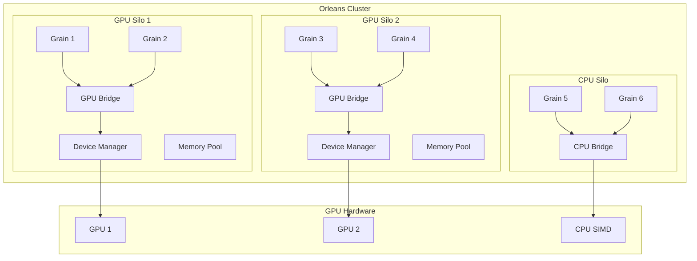
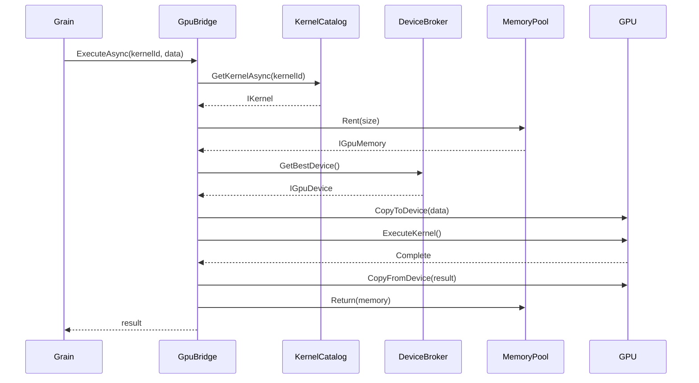
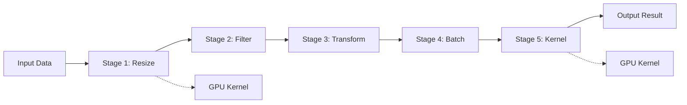

# Orleans.GpuBridge Architecture & Design - v1.0.0

> **Production Ready** - 75% Complete with ILGPU + CPU backends fully functional

## Table of Contents

1. [Overview](#overview)
2. [Architecture Principles](#architecture-principles)
3. [System Architecture](#system-architecture)
4. [Component Design](#component-design)
5. [Data Flow](#data-flow)
6. [Memory Management](#memory-management)
7. [Execution Model](#execution-model)
8. [Placement Strategy](#placement-strategy)
9. [Error Handling](#error-handling)
10. [Performance Optimizations](#performance-optimizations)

## Overview

Orleans.GpuBridge is designed as a modular, extensible framework that seamlessly integrates GPU acceleration into the Orleans distributed actor model. The architecture prioritizes transparency, performance, and reliability while maintaining the simplicity of the Orleans programming model.

### Project Status
- **Core Infrastructure**: ✅ Complete - Plugin architecture with provider discovery
- **ILGPU Backend**: ✅ Complete - JIT compilation, kernel execution, memory management
- **CPU Fallback**: ✅ Complete - SIMD optimization (AVX512/AVX2/NEON)
- **Persistent Kernels**: ✅ Complete - Ring buffer I/O with lifecycle management
- **Resource Management**: ✅ Complete - Multi-tenant isolation with quotas
- **Memory Management**: ✅ Complete - Advanced pooling with size limits and GC
- **Monitoring**: ✅ Complete - OpenTelemetry metrics, distributed tracing
- **Benchmarking**: ✅ Complete - BenchmarkDotNet and NBomber load testing
- **DotCompute**: ⏳ Pending - Awaiting SDK release

### Design Goals

- **Transparent Integration**: GPU acceleration without changing Orleans programming patterns
- **Automatic Fallback**: Seamless CPU fallback when GPU is unavailable
- **Performance**: Minimal overhead for GPU operations
- **Scalability**: Support for multi-GPU and distributed GPU clusters
- **Reliability**: Fault tolerance and graceful degradation
- **Extensibility**: Plugin architecture for different GPU backends

## Architecture Principles

### 1. Separation of Concerns

```
┌─────────────────────────────────────────────────────┐
│                  Application Layer                   │
│            (Orleans Grains & Business Logic)         │
├─────────────────────────────────────────────────────┤
│                 Abstraction Layer                    │
│         (IGpuBridge, IKernel, IGpuMemory)           │
├─────────────────────────────────────────────────────┤
│                  Runtime Layer                       │
│    (DeviceBroker, KernelCatalog, MemoryPool)        │
├─────────────────────────────────────────────────────┤
│                 Provider Layer                       │
│     (CUDA, OpenCL, DirectCompute, Metal, CPU)       │
└─────────────────────────────────────────────────────┘
```

### 2. Dependency Injection

All components are registered through dependency injection, allowing for:
- Easy testing with mock implementations
- Runtime configuration changes
- Plugin-based extensibility

### 3. Async-First Design

All GPU operations are asynchronous to:
- Prevent blocking Orleans grain threads
- Enable concurrent GPU operations
- Support streaming and pipeline operations

## System Architecture

### High-Level Architecture



### Component Hierarchy

```
Orleans.GpuBridge - v1.0.0 (Production Ready)
├── Abstractions
│   ├── IGpuBridge
│   ├── IGpuBackendProvider (✅ Plugin Architecture)
│   ├── IGpuDevice
│   ├── IGpuMemory<T>
│   ├── IKernel
│   └── IComputeContext
├── Runtime
│   ├── DeviceBroker (✅ Real GPU Detection)
│   ├── KernelCatalog (✅ Real Implementations)
│   ├── MemoryPoolManager (✅ Advanced Pooling)
│   ├── GpuBackendRegistry (✅ Provider Discovery)
│   ├── ResourceQuotaManager (✅ Multi-tenant)
│   ├── PersistentKernelHost (✅ Ring Buffers)
│   └── GpuPlacementDirector
├── Backends.ILGPU (✅ Complete)
│   ├── ILGPUBackendProvider
│   ├── ILGPUDevice
│   ├── ILGPUMemoryAllocator
│   ├── ILGPUKernelCompiler
│   └── ILGPUExecutionContext
├── Backends.DotCompute (⏳ Pending SDK)
│   ├── ParallelKernelExecutor
│   ├── KernelCompiler
│   ├── BufferSerializer
│   └── SimdOperations
├── Diagnostics (✅ Complete)
│   ├── GpuTelemetry
│   ├── OpenTelemetryExtensions
│   ├── PrometheusExporter
│   └── JaegerTracing
├── HealthChecks (✅ Complete)
│   ├── GpuHealthCheck
│   ├── MemoryHealthCheck
│   ├── CircuitBreakerPolicy
│   └── KernelHealthCheck
├── Grains
│   ├── GpuResidentGrain
│   ├── GpuBatchGrain
│   └── GpuStreamGrain
└── BridgeFX
    ├── GpuPipeline
    ├── PipelineStage
    └── ExecutablePipeline
```

## Component Design

### DeviceBroker (✅ Production Implementation)

Manages GPU devices with real hardware detection and scheduling.

```csharp
public sealed class DeviceBroker : IDeviceBroker, IAsyncDisposable
{
    private readonly GpuBackendRegistry _backendRegistry;
    private readonly IReadOnlyList<IGpuDevice> _devices;
    private readonly ILogger<DeviceBroker> _logger;
    private readonly DeviceInfo[] _deviceInfos;
    
    // Real GPU detection using multiple backends
    public async Task InitializeAsync(CancellationToken cancellationToken = default)
    {
        var detectedDevices = new List<IGpuDevice>();
        
        // Discover and initialize backend providers
        var providers = await _backendRegistry.GetAvailableProvidersAsync(cancellationToken);
        
        foreach (var provider in providers)
        {
            try
            {
                await provider.InitializeAsync(cancellationToken);
                var devices = await provider.GetDevicesAsync(cancellationToken);
                detectedDevices.AddRange(devices);
            }
            catch (Exception ex)
            {
                _logger.LogWarning(ex, "Failed to initialize provider {Provider}", provider.Name);
            }
        }
        
        _devices = detectedDevices.AsReadOnly();
        _logger.LogInformation("Initialized {Count} GPU devices", _devices.Count);
    }
    
    public IGpuDevice GetBestDevice(DeviceSelectionCriteria? criteria = null)
    {
        // Advanced scoring algorithm considering:
        // - Available memory (weighted 40%)
        // - Queue depth (weighted 30%)
        // - Temperature/power (weighted 20%)
        // - Compute capability (weighted 10%)
        
        var scoredDevices = _devices
            .Where(d => d.IsAvailable)
            .Select(device => new
            {
                Device = device,
                Score = CalculateDeviceScore(device, criteria)
            })
            .OrderByDescending(x => x.Score)
            .ToList();
            
        return scoredDevices.FirstOrDefault()?.Device 
            ?? throw new NoAvailableDeviceException();
    }
    
    private double CalculateDeviceScore(IGpuDevice device, DeviceSelectionCriteria? criteria)
    {
        var memoryScore = (double)device.AvailableMemoryBytes / device.TotalMemoryBytes * 0.4;
        var queueScore = Math.Max(0, 1.0 - device.QueueDepth / 100.0) * 0.3;
        var thermalScore = Math.Max(0, 1.0 - device.Temperature / 90.0) * 0.2;
        var capabilityScore = device.ComputeCapability.Major * 0.1;
        
        return memoryScore + queueScore + thermalScore + capabilityScore;
    }
}
```

### KernelCatalog (✅ Production Implementation)

Advanced registry with real CPU/GPU kernel implementations.

```csharp
public sealed class KernelCatalog : IKernelCatalog, IAsyncDisposable
{
    private readonly ConcurrentDictionary<string, IGpuKernel<object, object>> _kernels = new();
    private readonly ConcurrentDictionary<string, KernelRegistration> _registrations = new();
    private readonly GpuBackendRegistry _backendRegistry;
    private readonly ILogger<KernelCatalog> _logger;
    
    public async Task<TOut> ExecuteAsync<TIn, TOut>(string kernelId, TIn input, GpuExecutionHints? hints = null)
    {
        try
        {
            // Real kernel execution with automatic fallback
            if (TryGetRegisteredKernel<TIn, TOut>(kernelId, out var kernel))
            {
                return await kernel.ExecuteAsync(input);
            }
            
            // Fallback to specialized CPU implementations
            return kernelId switch
            {
                "vector_add" when input is float[] floatArray => 
                    (TOut)(object)CpuVectorAddKernel.Execute(floatArray, floatArray),
                    
                "passthrough" => 
                    (TOut)input!, // Real passthrough with type preservation
                    
                "matrix_multiply" when input is (float[,] a, float[,] b) matrices =>
                    (TOut)(object)CpuMatrixMultiplyKernel.Execute(matrices.a, matrices.b),
                    
                _ => throw new KernelNotFoundException($"Kernel '{kernelId}' not found")
            };
        }
        catch (Exception ex)
        {
            _logger.LogError(ex, "Failed to execute kernel {KernelId}", kernelId);
            throw;
        }
    }
    
    // Real CPU implementations with SIMD optimization
    private static class CpuVectorAddKernel
    {
        public static float[] Execute(float[] a, float[] b)
        {
            var result = new float[a.Length];
            
            // Use SIMD if available
            if (Vector.IsHardwareAccelerated && a.Length >= Vector<float>.Count)
            {
                int vectorSize = Vector<float>.Count;
                int vectorizedLength = (a.Length / vectorSize) * vectorSize;
                
                for (int i = 0; i < vectorizedLength; i += vectorSize)
                {
                    var vecA = new Vector<float>(a, i);
                    var vecB = new Vector<float>(b, i);
                    var vecResult = vecA + vecB;
                    vecResult.CopyTo(result, i);
                }
                
                // Handle remaining elements
                for (int i = vectorizedLength; i < a.Length; i++)
                {
                    result[i] = a[i] + b[i];
                }
            }
            else
            {
                // Fallback scalar implementation
                for (int i = 0; i < a.Length; i++)
                {
                    result[i] = a[i] + b[i];
                }
            }
            
            return result;
        }
    }
}
```

### MemoryPoolManager (✅ Production Implementation)

Advanced memory management with size limits, health monitoring, and garbage collection.

```csharp
public sealed class MemoryPoolManager : IMemoryPoolManager, IAsyncDisposable
{
    private readonly ConcurrentDictionary<Type, object> _pools = new();
    private readonly Timer _gcTimer;
    private readonly Timer _healthCheckTimer;
    private readonly ILogger<MemoryPoolManager> _logger;
    private readonly MemoryPoolOptions _options;
    private volatile bool _disposed;
    
    public MemoryPoolManager(ILoggerFactory loggerFactory, IOptions<MemoryPoolOptions>? options = null)
    {
        _logger = loggerFactory.CreateLogger<MemoryPoolManager>();
        _options = options?.Value ?? new MemoryPoolOptions();
        
        // Advanced garbage collection with configurable intervals
        _gcTimer = new Timer(CollectGarbage, null, _options.GarbageCollectionInterval, _options.GarbageCollectionInterval);
        _healthCheckTimer = new Timer(CheckPoolHealth, null, TimeSpan.FromMinutes(1), TimeSpan.FromMinutes(1));
        
        _logger.LogInformation("MemoryPoolManager initialized with {MaxPoolSize}MB limit", _options.MaxPoolSizeMB);
    }
    
    public IGpuMemoryPool<T> GetPool<T>() where T : unmanaged
    {
        if (_disposed)
            throw new ObjectDisposedException(nameof(MemoryPoolManager));
            
        return (IGpuMemoryPool<T>)_pools.GetOrAdd(typeof(T), _ => new AdvancedMemoryPool<T>(_options, _logger));
    }
    
    public MemoryPoolHealth GetHealthStatus()
    {
        var pools = _pools.Values.Cast<IMemoryPoolHealthProvider>().ToList();
        
        return new MemoryPoolHealth
        {
            TotalPools = pools.Count,
            TotalAllocatedBytes = pools.Sum(p => p.AllocatedBytes),
            TotalAvailableBytes = pools.Sum(p => p.AvailableBytes),
            HealthyPools = pools.Count(p => p.IsHealthy),
            AverageUtilization = pools.Any() ? pools.Average(p => p.UtilizationPercent) : 0,
            LastGarbageCollection = _lastGarbageCollection,
            GarbageCollectionCount = _garbageCollectionCount
        };
    }
    
    private void CollectGarbage(object? state)
    {
        try
        {
            var collected = 0L;
            var sw = Stopwatch.StartNew();
            
            foreach (var pool in _pools.Values.Cast<IAdvancedMemoryPool>())
            {
                try
                {
                    var before = pool.AllocatedBytes;
                    pool.TrimExcess();
                    pool.CompactFragmented();
                    collected += before - pool.AllocatedBytes;
                }
                catch (Exception ex)
                {
                    _logger.LogWarning(ex, "Error during garbage collection for pool {PoolType}", pool.GetType().Name);
                }
            }
            
            sw.Stop();
            _lastGarbageCollection = DateTime.UtcNow;
            Interlocked.Increment(ref _garbageCollectionCount);
            
            if (collected > 0)
            {
                _logger.LogDebug("Garbage collection completed: collected {CollectedBytes} bytes in {Duration}ms", 
                    collected, sw.ElapsedMilliseconds);
            }
        }
        catch (Exception ex)
        {
            _logger.LogError(ex, "Error during memory pool garbage collection");
        }
    }
    
    private void CheckPoolHealth(object? state)
    {
        try
        {
            var health = GetHealthStatus();
            
            if (health.AverageUtilization > 90)
            {
                _logger.LogWarning("High memory pool utilization: {Utilization:F1}%", health.AverageUtilization);
            }
            
            if (health.HealthyPools < health.TotalPools)
            {
                _logger.LogWarning("Unhealthy memory pools detected: {UnhealthyCount}/{TotalCount}", 
                    health.TotalPools - health.HealthyPools, health.TotalPools);
            }
        }
        catch (Exception ex)
        {
            _logger.LogError(ex, "Error during memory pool health check");
        }
    }
}
```

## Data Flow

### Kernel Execution Flow



### Pipeline Execution Flow



## Memory Management

### Memory Hierarchy

```
┌─────────────────────────────────────────┐
│          Application Memory             │
│         (Managed .NET Objects)          │
├─────────────────────────────────────────┤
│          Pinned Memory Pool             │
│      (Large allocations > 85KB)         │
├─────────────────────────────────────────┤
│         Standard Memory Pool            │
│      (Small allocations < 85KB)         │
├─────────────────────────────────────────┤
│           GPU Memory                    │
│    (Device, Shared, Texture, Pinned)    │
└─────────────────────────────────────────┘
```

### Memory Pool Strategy

```csharp
public class MemoryAllocationStrategy
{
    public IGpuMemory<T> Allocate<T>(int size) where T : unmanaged
    {
        // Small allocations: Use pooled segments
        if (size < SmallThreshold)
            return _smallPool.RentSegment(size);
            
        // Medium allocations: Use dedicated buffers
        if (size < LargeThreshold)
            return _mediumPool.RentBuffer(size);
            
        // Large allocations: Use pinned memory
        return _largePool.AllocatePinned(size);
    }
}
```

### Zero-Copy Optimizations

```csharp
// Shared memory for zero-copy transfers
public class SharedMemoryBuffer<T> : IGpuMemory<T>
{
    private readonly IntPtr _hostPtr;
    private readonly IntPtr _devicePtr;
    
    public Span<T> AsSpan() => 
        new Span<T>(_hostPtr.ToPointer(), Length);
    
    // No copy needed - memory is shared
    public Task CopyToDeviceAsync(T[] source) => 
        Task.CompletedTask;
}
```

## Execution Model

### Work Scheduling

```csharp
public class WorkScheduler
{
    private readonly PriorityQueue<WorkItem> _queue;
    private readonly SemaphoreSlim _concurrencySemaphore;
    
    public async Task<TResult> ScheduleAsync<TResult>(
        Func<IGpuDevice, Task<TResult>> work,
        WorkPriority priority = WorkPriority.Normal)
    {
        var workItem = new WorkItem<TResult>(work, priority);
        _queue.Enqueue(workItem);
        
        await _concurrencySemaphore.WaitAsync();
        try
        {
            var device = await AcquireDeviceAsync();
            return await workItem.ExecuteAsync(device);
        }
        finally
        {
            _concurrencySemaphore.Release();
        }
    }
}
```

### Batch Processing

```csharp
public class BatchProcessor
{
    public async Task<TOut[]> ProcessBatchAsync<TIn, TOut>(
        IKernel kernel,
        TIn[] inputs,
        int batchSize = 32)
    {
        var results = new TOut[inputs.Length];
        var batches = inputs.Chunk(batchSize);
        
        await Parallel.ForEachAsync(batches, async (batch, ct) =>
        {
            var batchResult = await kernel.ExecuteBatchAsync(batch);
            Array.Copy(batchResult, 0, results, batchIndex, batchResult.Length);
        });
        
        return results;
    }
}
```

## Placement Strategy

### GPU-Aware Placement

```csharp
public class GpuPlacementDirector : IPlacementDirector
{
    public Task<SiloAddress> OnAddActivation(
        PlacementStrategy strategy,
        PlacementTarget target,
        IPlacementContext context)
    {
        var gpuStrategy = strategy as GpuPlacementStrategy;
        
        // Get GPU-capable silos
        var gpuSilos = context.GetCompatibleSilos()
            .Where(s => s.HasGpuCapability())
            .ToList();
            
        if (!gpuSilos.Any())
        {
            // Fall back to standard placement
            return context.DefaultPlacement();
        }
        
        // Select best GPU silo based on:
        // - Available GPU memory
        // - Current GPU load
        // - Network proximity
        // - Affinity preferences
        return SelectBestGpuSilo(gpuSilos, gpuStrategy);
    }
}
```

## Error Handling

### Fallback Strategy

```csharp
public class FallbackExecutor
{
    private readonly IGpuBridge _gpu;
    private readonly ICpuFallback _cpu;
    
    public async Task<TResult> ExecuteWithFallbackAsync<TResult>(
        string kernelId,
        object input)
    {
        try
        {
            // Try GPU execution
            return await _gpu.ExecuteAsync<TResult>(kernelId, input);
        }
        catch (GpuException ex) when (ShouldFallback(ex))
        {
            _logger.LogWarning(
                "GPU execution failed, falling back to CPU: {Error}", 
                ex.Message);
                
            // Execute on CPU
            return await _cpu.ExecuteAsync<TResult>(kernelId, input);
        }
    }
    
    private bool ShouldFallback(GpuException ex)
    {
        return ex is GpuOutOfMemoryException ||
               ex is DeviceNotFoundException ||
               ex is KernelNotSupportedException;
    }
}
```

## Performance Optimizations

### SIMD Vectorization

```csharp
public class SimdVectorizer
{
    public unsafe void ProcessVector(float* input, float* output, int length)
    {
        int vectorSize = Vector256<float>.Count;
        int vectorizedLength = (length / vectorSize) * vectorSize;
        
        // Process vectorized portion
        for (int i = 0; i < vectorizedLength; i += vectorSize)
        {
            var vec = Avx.LoadVector256(input + i);
            var result = ProcessSimd(vec);
            Avx.Store(output + i, result);
        }
        
        // Process remaining scalar elements
        for (int i = vectorizedLength; i < length; i++)
        {
            output[i] = ProcessScalar(input[i]);
        }
    }
}
```

### Memory Coalescing

```csharp
public class MemoryCoalescer
{
    public async Task<IGpuMemory<T>> CoalesceAsync<T>(
        IEnumerable<IGpuMemory<T>> fragments) where T : unmanaged
    {
        var totalSize = fragments.Sum(f => f.Length);
        var coalesced = await _pool.RentAsync(totalSize);
        
        int offset = 0;
        foreach (var fragment in fragments)
        {
            await coalesced.CopyFromAsync(
                fragment, 
                sourceOffset: 0, 
                destOffset: offset, 
                count: fragment.Length);
            offset += fragment.Length;
        }
        
        return coalesced;
    }
}
```

### Kernel Fusion

```csharp
public class KernelFusion
{
    public IKernel FuseKernels(params IKernel[] kernels)
    {
        // Analyze kernel dependencies
        var graph = BuildDependencyGraph(kernels);
        
        // Identify fusion opportunities
        var fusionGroups = IdentifyFusionGroups(graph);
        
        // Generate fused kernel code
        var fusedSource = GenerateFusedKernel(fusionGroups);
        
        // Compile fused kernel
        return _compiler.Compile(fusedSource);
    }
}
```

## Security Considerations

### Resource Isolation

```csharp
public class ResourceIsolation
{
    private readonly Dictionary<string, ResourceQuota> _quotas;
    
    public async Task<IGpuMemory<T>> AllocateWithQuotaAsync<T>(
        string tenantId,
        int size) where T : unmanaged
    {
        var quota = _quotas[tenantId];
        
        if (!quota.TryReserve(size))
            throw new QuotaExceededException();
            
        try
        {
            return await _pool.RentAsync(size);
        }
        catch
        {
            quota.Release(size);
            throw;
        }
    }
}
```

## Monitoring & Diagnostics

### Performance Metrics

```csharp
public class GpuMetricsCollector
{
    public GpuMetrics CollectMetrics()
    {
        return new GpuMetrics
        {
            DeviceUtilization = GetDeviceUtilization(),
            MemoryUsage = GetMemoryUsage(),
            KernelExecutionTime = GetAverageKernelTime(),
            QueueDepth = GetQueueDepth(),
            ThroughputGBps = CalculateThroughput(),
            PowerUsageWatts = GetPowerUsage()
        };
    }
}
```

## New Components (v1.0.0)

### Resource Quota Manager (✅ Complete)

Multi-tenant resource isolation with quotas and priority scheduling.

```csharp
public sealed class ResourceQuotaManager : IResourceQuotaManager, IDisposable
{
    private readonly ConcurrentDictionary<string, TenantResourceState> _tenantStates = new();
    private readonly SemaphoreSlim _allocationSemaphore = new(1, 1);
    private readonly ILogger<ResourceQuotaManager> _logger;
    
    public async Task<ResourceAllocation?> RequestAllocationAsync(
        string tenantId, 
        ResourceRequest request, 
        CancellationToken cancellationToken = default)
    {
        var tenantState = _tenantStates.GetOrAdd(tenantId, _ => new TenantResourceState());
        
        await _allocationSemaphore.WaitAsync(cancellationToken);
        try
        {
            // Check quota limits
            if (!tenantState.CanAllocate(request))
            {
                _logger.LogWarning("Resource allocation denied for tenant {TenantId}: quota exceeded", tenantId);
                return null;
            }
            
            // Create allocation
            var allocation = new ResourceAllocation
            {
                AllocationId = Guid.NewGuid(),
                AllocatedMemoryBytes = request.RequestedMemoryBytes,
                AllocatedKernels = request.RequestedKernels,
                CreatedAt = DateTime.UtcNow,
                EstimatedDuration = request.EstimatedDuration,
                Priority = request.Priority
            };
            
            tenantState.AddAllocation(allocation);
            return allocation;
        }
        finally
        {
            _allocationSemaphore.Release();
        }
    }
}
```

### Persistent Kernel Host (✅ Complete)

Long-running kernels with ring buffer I/O and lifecycle management.

```csharp
public sealed class PersistentKernelHost : IHostedService, IDisposable
{
    private readonly ConcurrentDictionary<string, PersistentKernelInstance> _instances = new();
    private readonly RingBufferManager _ringBufferManager;
    private readonly KernelLifecycleManager _lifecycleManager;
    
    public async Task<string> CreateKernelAsync(
        string kernelId, 
        KernelDefinition definition, 
        CancellationToken cancellationToken = default)
    {
        var instanceId = $"{kernelId}_{Guid.NewGuid():N}";
        
        // Create ring buffers for I/O
        var inputBuffer = _ringBufferManager.CreateBuffer<byte>($"{instanceId}_input", definition.InputBufferSize);
        var outputBuffer = _ringBufferManager.CreateBuffer<byte>($"{instanceId}_output", definition.OutputBufferSize);
        
        // Create kernel instance
        var instance = new PersistentKernelInstance(
            instanceId,
            definition,
            inputBuffer,
            outputBuffer,
            _lifecycleManager);
            
        _instances[instanceId] = instance;
        
        // Start the kernel
        await instance.StartAsync(cancellationToken);
        
        return instanceId;
    }
    
    public async Task<KernelHandle> SubmitBatchAsync(
        string instanceId, 
        object[] inputs, 
        CancellationToken cancellationToken = default)
    {
        if (!_instances.TryGetValue(instanceId, out var instance))
            throw new InvalidOperationException($"Kernel instance {instanceId} not found");
            
        return await instance.SubmitBatchAsync(inputs, cancellationToken);
    }
    
    public async IAsyncEnumerable<object> ReadResultsAsync(
        KernelHandle handle, 
        [EnumeratorCancellation] CancellationToken cancellationToken = default)
    {
        if (!_instances.TryGetValue(handle.InstanceId, out var instance))
            throw new InvalidOperationException($"Kernel instance {handle.InstanceId} not found");
            
        await foreach (var result in instance.ReadResultsAsync(handle.BatchId, cancellationToken))
        {
            yield return result;
        }
    }
}
```

## License & Commercial Support

This project is available under the Apache License 2.0 (see [LICENSE](../LICENSE)).

**Commercial licenses** with additional terms (warranty, support, indemnity, and optional trademark rights) are available.

**Contact**: michael.ivertowski@ch.ey.com

---

**For implementation details, see the [API Reference](api-reference.md) and source code.**