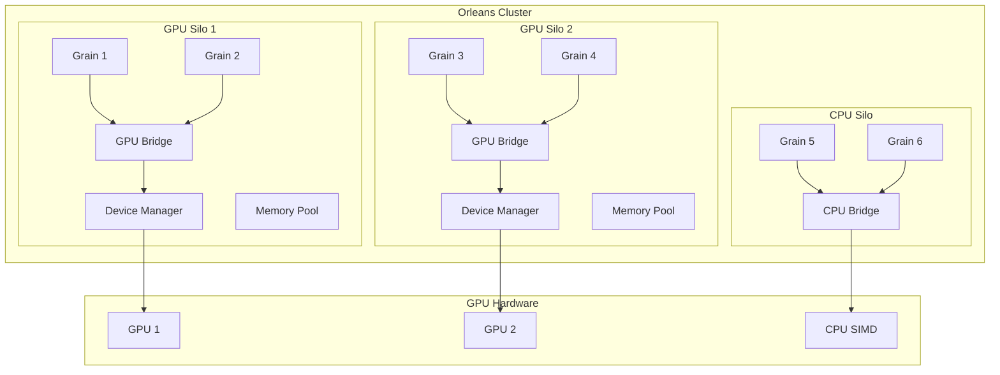
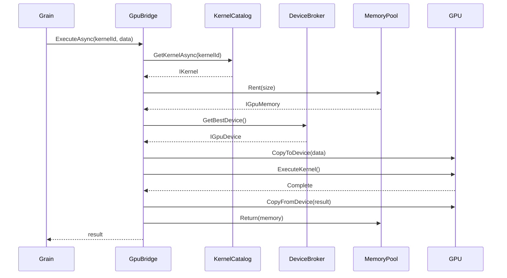
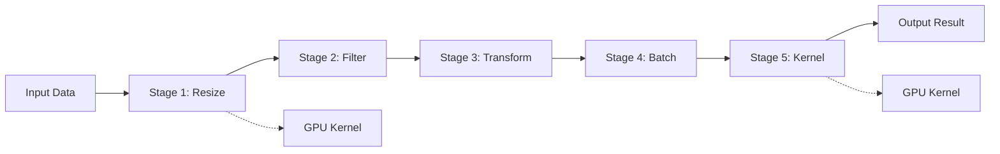

# Orleans.GpuBridge Architecture & Design

## Table of Contents

1. [Overview](#overview)
2. [Architecture Principles](#architecture-principles)
3. [System Architecture](#system-architecture)
4. [Component Design](#component-design)
5. [Data Flow](#data-flow)
6. [Memory Management](#memory-management)
7. [Execution Model](#execution-model)
8. [Placement Strategy](#placement-strategy)
9. [Error Handling](#error-handling)
10. [Performance Optimizations](#performance-optimizations)

## Overview

Orleans.GpuBridge is designed as a modular, extensible framework that seamlessly integrates GPU acceleration into the Orleans distributed actor model. The architecture prioritizes transparency, performance, and reliability while maintaining the simplicity of the Orleans programming model.

### Design Goals

- **Transparent Integration**: GPU acceleration without changing Orleans programming patterns
- **Automatic Fallback**: Seamless CPU fallback when GPU is unavailable
- **Performance**: Minimal overhead for GPU operations
- **Scalability**: Support for multi-GPU and distributed GPU clusters
- **Reliability**: Fault tolerance and graceful degradation
- **Extensibility**: Plugin architecture for different GPU backends

## Architecture Principles

### 1. Separation of Concerns

```
┌─────────────────────────────────────────────────────┐
│                  Application Layer                   │
│            (Orleans Grains & Business Logic)         │
├─────────────────────────────────────────────────────┤
│                 Abstraction Layer                    │
│         (IGpuBridge, IKernel, IGpuMemory)           │
├─────────────────────────────────────────────────────┤
│                  Runtime Layer                       │
│    (DeviceBroker, KernelCatalog, MemoryPool)        │
├─────────────────────────────────────────────────────┤
│                 Provider Layer                       │
│     (CUDA, OpenCL, DirectCompute, Metal, CPU)       │
└─────────────────────────────────────────────────────┘
```

### 2. Dependency Injection

All components are registered through dependency injection, allowing for:
- Easy testing with mock implementations
- Runtime configuration changes
- Plugin-based extensibility

### 3. Async-First Design

All GPU operations are asynchronous to:
- Prevent blocking Orleans grain threads
- Enable concurrent GPU operations
- Support streaming and pipeline operations

## System Architecture

### High-Level Architecture



### Component Hierarchy

```
Orleans.GpuBridge
├── Abstractions
│   ├── IGpuBridge
│   ├── IGpuDevice
│   ├── IGpuMemory<T>
│   ├── IKernel
│   └── IComputeContext
├── Runtime
│   ├── DeviceBroker
│   ├── KernelCatalog
│   ├── MemoryPoolManager
│   ├── GpuPlacementDirector
│   └── BackendProviderFactory
├── DotCompute
│   ├── ParallelKernelExecutor
│   ├── KernelCompiler
│   ├── BufferSerializer
│   └── SimdOperations
├── Grains
│   ├── GpuResidentGrain
│   ├── GpuBatchGrain
│   └── GpuStreamGrain
└── BridgeFX
    ├── GpuPipeline
    ├── PipelineStage
    └── ExecutablePipeline
```

## Component Design

### DeviceBroker

Manages GPU devices and schedules work across them.

```csharp
internal class DeviceBroker
{
    private readonly List<GpuDevice> _devices;
    private readonly DeviceWorkQueue[] _workQueues;
    private readonly ILoadBalancer _loadBalancer;
    
    public IGpuDevice GetBestDevice()
    {
        // Score-based selection considering:
        // - Available memory
        // - Queue depth
        // - Compute capability
        // - Current load
        return _loadBalancer.SelectDevice(_devices);
    }
    
    public async Task<WorkHandle> EnqueueAsync(WorkItem work)
    {
        var device = GetBestDevice();
        var queue = _workQueues[device.Index];
        return await queue.EnqueueAsync(work);
    }
}
```

### KernelCatalog

Registry and lifecycle manager for GPU kernels.

```csharp
internal class KernelCatalog
{
    private readonly ConcurrentDictionary<string, IKernel> _kernels;
    private readonly IKernelCompiler _compiler;
    private readonly IKernelCache _cache;
    
    public async Task<IKernel> GetKernelAsync(string id)
    {
        // Check cache
        if (_cache.TryGet(id, out var cached))
            return cached;
            
        // Check registered kernels
        if (_kernels.TryGetValue(id, out var kernel))
            return kernel;
            
        // Attempt JIT compilation
        if (_autoCompile && _sources.TryGetValue(id, out var source))
        {
            kernel = await _compiler.CompileAsync(source);
            _kernels.TryAdd(id, kernel);
            return kernel;
        }
        
        throw new KernelNotFoundException(id);
    }
}
```

### MemoryPoolManager

Efficient memory management with pooling and garbage collection.

```csharp
internal class MemoryPoolManager
{
    private readonly Dictionary<Type, object> _pools;
    private readonly Timer _gcTimer;
    private readonly MemoryPoolOptions _options;
    
    public IGpuMemoryPool<T> GetPool<T>() where T : unmanaged
    {
        var type = typeof(T);
        if (!_pools.TryGetValue(type, out var pool))
        {
            pool = new AdvancedMemoryPool<T>(_options);
            _pools[type] = pool;
        }
        return (IGpuMemoryPool<T>)pool;
    }
    
    private void CollectGarbage()
    {
        foreach (var pool in _pools.Values)
        {
            if (pool is IMemoryPool mp)
            {
                mp.TrimExcess();
                mp.CompactFragmented();
            }
        }
    }
}
```

## Data Flow

### Kernel Execution Flow



### Pipeline Execution Flow



## Memory Management

### Memory Hierarchy

```
┌─────────────────────────────────────────┐
│          Application Memory             │
│         (Managed .NET Objects)          │
├─────────────────────────────────────────┤
│          Pinned Memory Pool             │
│      (Large allocations > 85KB)         │
├─────────────────────────────────────────┤
│         Standard Memory Pool            │
│      (Small allocations < 85KB)         │
├─────────────────────────────────────────┤
│           GPU Memory                    │
│    (Device, Shared, Texture, Pinned)    │
└─────────────────────────────────────────┘
```

### Memory Pool Strategy

```csharp
public class MemoryAllocationStrategy
{
    public IGpuMemory<T> Allocate<T>(int size) where T : unmanaged
    {
        // Small allocations: Use pooled segments
        if (size < SmallThreshold)
            return _smallPool.RentSegment(size);
            
        // Medium allocations: Use dedicated buffers
        if (size < LargeThreshold)
            return _mediumPool.RentBuffer(size);
            
        // Large allocations: Use pinned memory
        return _largePool.AllocatePinned(size);
    }
}
```

### Zero-Copy Optimizations

```csharp
// Shared memory for zero-copy transfers
public class SharedMemoryBuffer<T> : IGpuMemory<T>
{
    private readonly IntPtr _hostPtr;
    private readonly IntPtr _devicePtr;
    
    public Span<T> AsSpan() => 
        new Span<T>(_hostPtr.ToPointer(), Length);
    
    // No copy needed - memory is shared
    public Task CopyToDeviceAsync(T[] source) => 
        Task.CompletedTask;
}
```

## Execution Model

### Work Scheduling

```csharp
public class WorkScheduler
{
    private readonly PriorityQueue<WorkItem> _queue;
    private readonly SemaphoreSlim _concurrencySemaphore;
    
    public async Task<TResult> ScheduleAsync<TResult>(
        Func<IGpuDevice, Task<TResult>> work,
        WorkPriority priority = WorkPriority.Normal)
    {
        var workItem = new WorkItem<TResult>(work, priority);
        _queue.Enqueue(workItem);
        
        await _concurrencySemaphore.WaitAsync();
        try
        {
            var device = await AcquireDeviceAsync();
            return await workItem.ExecuteAsync(device);
        }
        finally
        {
            _concurrencySemaphore.Release();
        }
    }
}
```

### Batch Processing

```csharp
public class BatchProcessor
{
    public async Task<TOut[]> ProcessBatchAsync<TIn, TOut>(
        IKernel kernel,
        TIn[] inputs,
        int batchSize = 32)
    {
        var results = new TOut[inputs.Length];
        var batches = inputs.Chunk(batchSize);
        
        await Parallel.ForEachAsync(batches, async (batch, ct) =>
        {
            var batchResult = await kernel.ExecuteBatchAsync(batch);
            Array.Copy(batchResult, 0, results, batchIndex, batchResult.Length);
        });
        
        return results;
    }
}
```

## Placement Strategy

### GPU-Aware Placement

```csharp
public class GpuPlacementDirector : IPlacementDirector
{
    public Task<SiloAddress> OnAddActivation(
        PlacementStrategy strategy,
        PlacementTarget target,
        IPlacementContext context)
    {
        var gpuStrategy = strategy as GpuPlacementStrategy;
        
        // Get GPU-capable silos
        var gpuSilos = context.GetCompatibleSilos()
            .Where(s => s.HasGpuCapability())
            .ToList();
            
        if (!gpuSilos.Any())
        {
            // Fall back to standard placement
            return context.DefaultPlacement();
        }
        
        // Select best GPU silo based on:
        // - Available GPU memory
        // - Current GPU load
        // - Network proximity
        // - Affinity preferences
        return SelectBestGpuSilo(gpuSilos, gpuStrategy);
    }
}
```

## Error Handling

### Fallback Strategy

```csharp
public class FallbackExecutor
{
    private readonly IGpuBridge _gpu;
    private readonly ICpuFallback _cpu;
    
    public async Task<TResult> ExecuteWithFallbackAsync<TResult>(
        string kernelId,
        object input)
    {
        try
        {
            // Try GPU execution
            return await _gpu.ExecuteAsync<TResult>(kernelId, input);
        }
        catch (GpuException ex) when (ShouldFallback(ex))
        {
            _logger.LogWarning(
                "GPU execution failed, falling back to CPU: {Error}", 
                ex.Message);
                
            // Execute on CPU
            return await _cpu.ExecuteAsync<TResult>(kernelId, input);
        }
    }
    
    private bool ShouldFallback(GpuException ex)
    {
        return ex is GpuOutOfMemoryException ||
               ex is DeviceNotFoundException ||
               ex is KernelNotSupportedException;
    }
}
```

## Performance Optimizations

### SIMD Vectorization

```csharp
public class SimdVectorizer
{
    public unsafe void ProcessVector(float* input, float* output, int length)
    {
        int vectorSize = Vector256<float>.Count;
        int vectorizedLength = (length / vectorSize) * vectorSize;
        
        // Process vectorized portion
        for (int i = 0; i < vectorizedLength; i += vectorSize)
        {
            var vec = Avx.LoadVector256(input + i);
            var result = ProcessSimd(vec);
            Avx.Store(output + i, result);
        }
        
        // Process remaining scalar elements
        for (int i = vectorizedLength; i < length; i++)
        {
            output[i] = ProcessScalar(input[i]);
        }
    }
}
```

### Memory Coalescing

```csharp
public class MemoryCoalescer
{
    public async Task<IGpuMemory<T>> CoalesceAsync<T>(
        IEnumerable<IGpuMemory<T>> fragments) where T : unmanaged
    {
        var totalSize = fragments.Sum(f => f.Length);
        var coalesced = await _pool.RentAsync(totalSize);
        
        int offset = 0;
        foreach (var fragment in fragments)
        {
            await coalesced.CopyFromAsync(
                fragment, 
                sourceOffset: 0, 
                destOffset: offset, 
                count: fragment.Length);
            offset += fragment.Length;
        }
        
        return coalesced;
    }
}
```

### Kernel Fusion

```csharp
public class KernelFusion
{
    public IKernel FuseKernels(params IKernel[] kernels)
    {
        // Analyze kernel dependencies
        var graph = BuildDependencyGraph(kernels);
        
        // Identify fusion opportunities
        var fusionGroups = IdentifyFusionGroups(graph);
        
        // Generate fused kernel code
        var fusedSource = GenerateFusedKernel(fusionGroups);
        
        // Compile fused kernel
        return _compiler.Compile(fusedSource);
    }
}
```

## Security Considerations

### Resource Isolation

```csharp
public class ResourceIsolation
{
    private readonly Dictionary<string, ResourceQuota> _quotas;
    
    public async Task<IGpuMemory<T>> AllocateWithQuotaAsync<T>(
        string tenantId,
        int size) where T : unmanaged
    {
        var quota = _quotas[tenantId];
        
        if (!quota.TryReserve(size))
            throw new QuotaExceededException();
            
        try
        {
            return await _pool.RentAsync(size);
        }
        catch
        {
            quota.Release(size);
            throw;
        }
    }
}
```

## Monitoring & Diagnostics

### Performance Metrics

```csharp
public class GpuMetricsCollector
{
    public GpuMetrics CollectMetrics()
    {
        return new GpuMetrics
        {
            DeviceUtilization = GetDeviceUtilization(),
            MemoryUsage = GetMemoryUsage(),
            KernelExecutionTime = GetAverageKernelTime(),
            QueueDepth = GetQueueDepth(),
            ThroughputGBps = CalculateThroughput(),
            PowerUsageWatts = GetPowerUsage()
        };
    }
}
```

---

**For implementation details, see the [API Reference](api-reference.md) and source code.**