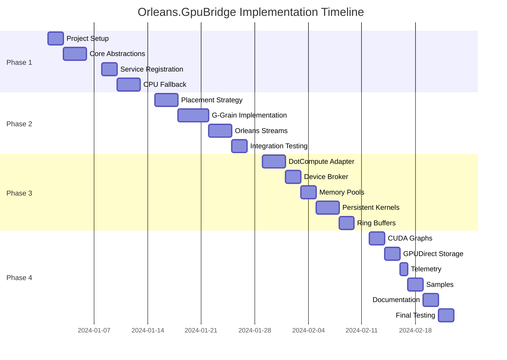

# Orleans.GpuBridge Implementation Planning

## Overview

This directory contains the comprehensive implementation planning documentation for Orleans.GpuBridge, a distributed GPU compute acceleration framework for Microsoft Orleans. The planning is divided into four phases over eight weeks, with detailed specifications, technical requirements, and success criteria.

## Documentation Structure

### 📋 [MASTER_PLAN.md](MASTER_PLAN.md)
The executive overview of the entire project, including:
- High-level architecture vision
- Phase summaries and timeline
- Key deliverables and success criteria
- Risk mitigation strategies
- 8-week implementation timeline

### Phase Implementation Specifications

#### 🏗️ [PHASE_1_FOUNDATION.md](PHASE_1_FOUNDATION.md) - Weeks 1-2
Foundation and core infrastructure:
- Project setup and build configuration
- Core abstractions (IGpuBridge, IGpuKernel)
- Service registration and dependency injection
- CPU fallback kernel system
- Basic testing framework

#### 🔌 [PHASE_2_ORLEANS_INTEGRATION.md](PHASE_2_ORLEANS_INTEGRATION.md) - Weeks 3-4
Orleans framework integration:
- Custom GPU placement strategy
- G-Grain implementations (Batch, Stream, Resident)
- Orleans Streams integration
- Grain lifecycle management
- Integration testing with TestingHost

#### ⚡ [PHASE_3_GPU_RUNTIME.md](PHASE_3_GPU_RUNTIME.md) - Weeks 5-6
GPU runtime implementation:
- DotCompute backend adapter
- Device broker and resource management
- Persistent kernel hosts
- Ring buffer communication
- GPU memory pool management

#### 🚀 [PHASE_4_PRODUCTION_HARDENING.md](PHASE_4_PRODUCTION_HARDENING.md) - Weeks 7-8
Production optimization and polish:
- CUDA Graph optimization
- GPUDirect Storage integration
- OpenTelemetry monitoring
- Performance benchmarking
- Production samples and documentation

### 📦 [TECHNICAL_REQUIREMENTS.md](TECHNICAL_REQUIREMENTS.md)
Complete technical requirements including:
- Hardware and software requirements
- Dependency specifications
- Version compatibility matrix
- Environment configuration
- Performance targets

## Quick Start Guide

### For Project Managers
1. Review [MASTER_PLAN.md](MASTER_PLAN.md) for timeline and deliverables
2. Check success criteria for each phase
3. Monitor risk mitigation strategies

### For Developers
1. Start with [PHASE_1_FOUNDATION.md](PHASE_1_FOUNDATION.md) for setup
2. Review [TECHNICAL_REQUIREMENTS.md](TECHNICAL_REQUIREMENTS.md) for dependencies
3. Follow phase specifications sequentially

### For DevOps/Infrastructure
1. Check [TECHNICAL_REQUIREMENTS.md](TECHNICAL_REQUIREMENTS.md) for system requirements
2. Review Phase 4 for deployment guidance
3. Prepare GPU-enabled testing infrastructure

## Implementation Timeline



## Key Technologies

### Core Stack
- **.NET 9.0**: Primary runtime platform
- **Orleans 8.0**: Distributed actor framework
- **DotCompute**: Unified GPU compute abstraction

### GPU Backends
- **CUDA 12.3**: NVIDIA GPU support
- **OpenCL 3.0**: Cross-vendor GPU support
- **DirectCompute**: Windows GPU support
- **Metal**: Apple Silicon support

### Infrastructure
- **Docker**: Container deployment
- **Kubernetes**: Orchestration
- **OpenTelemetry**: Observability
- **Prometheus/Grafana**: Monitoring

## Success Metrics

### Performance
- ✅ Sub-millisecond kernel latency (P50)
- ✅ 1-5M operations/second per GPU
- ✅ Zero-copy memory transfers > 1MB
- ✅ 80%+ GPU utilization under load

### Quality
- ✅ 90%+ unit test coverage
- ✅ 24-hour stability testing
- ✅ Comprehensive error handling
- ✅ Production-ready documentation

### Integration
- ✅ Seamless Orleans integration
- ✅ Transparent CPU/GPU execution
- ✅ Compatible with Orleans Streams
- ✅ Custom placement strategies

## Risk Management

### Technical Risks
| Risk | Impact | Mitigation |
|------|--------|------------|
| GPU driver incompatibility | High | Multi-backend support via DotCompute |
| Memory pressure | Medium | Aggressive pooling and eviction |
| Kernel deadlocks | High | Watchdog timers and forced termination |
| Network latency | Medium | Local placement preference |

### Schedule Risks
| Risk | Impact | Mitigation |
|------|--------|------------|
| DotCompute delays | High | Implement CPU fallback first |
| Hardware unavailability | Medium | Cloud GPU instances for testing |
| Integration complexity | Medium | Incremental integration approach |

## Getting Started

### Prerequisites
1. Install .NET 9.0 SDK
2. Install CUDA Toolkit 12.3 (optional)
3. Clone the repository
4. Review technical requirements

### Build Steps
```bash
# Create solution structure (Phase 1, Day 1-2)
dotnet new sln -n Orleans.GpuBridge
dotnet new classlib -n Orleans.GpuBridge.Abstractions -o src/Orleans.GpuBridge.Abstractions
# ... (see PHASE_1_FOUNDATION.md for complete steps)

# Build the solution
dotnet build

# Run tests
dotnet test
```

### Development Workflow
1. **Week 1-2**: Foundation - Set up project, implement abstractions
2. **Week 3-4**: Integration - Add Orleans-specific features
3. **Week 5-6**: GPU Runtime - Implement actual GPU execution
4. **Week 7-8**: Hardening - Optimize and prepare for production

## Resources

### Documentation
- [Orleans Documentation](https://learn.microsoft.com/en-us/dotnet/orleans/)
- [DotCompute Repository](https://github.com/mivertowski/DotCompute)
- [CUDA Programming Guide](https://docs.nvidia.com/cuda/cuda-c-programming-guide/)

### Support
- GitHub Issues: [Project Issues](https://github.com/orleans/gpu-bridge/issues)
- Community Discord: [Orleans Discord](https://discord.gg/orleans)
- Stack Overflow: Tag with `orleans-gpu`

## Contributing

Please review the planning documentation before contributing:
1. Understand the architecture in MASTER_PLAN.md
2. Follow the phase structure for new features
3. Ensure compatibility with technical requirements
4. Add tests for all new functionality
5. Update documentation as needed

## Next Steps

1. **Immediate**: Review and approve MASTER_PLAN.md
2. **Week 1**: Begin Phase 1 implementation
3. **Ongoing**: Set up CI/CD pipeline
4. **Weekly**: Progress reviews and adjustments

---

*This planning documentation represents a comprehensive 8-week implementation strategy for Orleans.GpuBridge, designed to deliver a production-ready GPU acceleration framework for Orleans applications.*